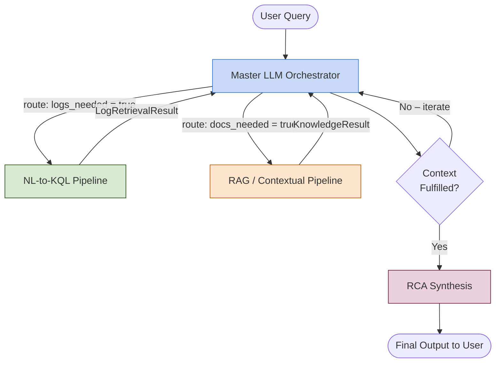

# AGENTS.md — NexGen: AI-Driven Framework for Natural Log Investigation

> **Read this file first.** Every contributor and every sub-agent implementation must conform to the contracts defined here. Nothing in `master.md`, `query.md`, or `rag.md` may contradict this document; those files extend it.

---

## 1. Project Vision

NexGen is an autonomous, multi-agent observability framework that transforms raw, unstructured system logs into human-readable root-cause analyses (RCA). A user asks a plain-English question; NexGen retrieves the relevant logs from an ELK (Elasticsearch / Logstash / Kibana) stack, enriches them with organisational knowledge (runbooks, Slack threads, Jira tickets, code repositories), and synthesises a logically sound, confidence-scored diagnostic narrative — all without the user writing a single KQL query.

The system is composed of **three independently developed components** that communicate exclusively through well-defined JSON contracts:

| Component | Document | Responsibility |
|-----------|----------|----------------|
| **Master LLM Orchestrator** | `master.md` | Intent routing, DAG planning, state management, final RCA synthesis |
| **NL-to-KQL Pipeline** | `query.md` | Translating natural language into executable KQL; log retrieval |
| **RAG / Contextual Pipeline** | `rag.md` | Retrieving and compressing organisational knowledge; context delivery |

---

## 2. High-Level Architecture



---

## 3. Component Boundaries

Each component is a **self-contained service** (Python package or FastAPI micro-service). Components:

- **Must not** import each other's internal modules.
- **Must not** share a mutable in-process state.
- **Must** communicate only through the JSON schemas defined in §5.
- **Must** be independently startable and independently testable.

---

## 4. Common Technology Decisions

| Concern | Decision |
|---------|----------|
| Runtime language | Python ≥ 3.11 |
| HTTP transport (inter-service) | REST over HTTP/1.1 (localhost in dev, Docker network in prod) |
| Async framework | `asyncio` + `httpx` for all inter-component calls |
| Serialisation | JSON (`pydantic` v2 models — see §5) |
| Vector store | Qdrant (self-hosted) |
| Primary LLM backend | Ollama (local) — Llama 3.2 for Master; Qwen 3.5-Coder for NL-to-KQL |
| Embedding model | `nomic-embed-text` via Ollama |
| Logging / tracing | `structlog` + OpenTelemetry spans; all components emit to the same OTLP collector |
| Configuration | `pydantic-settings`; one `.env` file per component; shared keys documented in `config/shared.env.example` |
| Testing | `pytest` + `pytest-asyncio`; minimum 80 % branch coverage per component |
| Linting | `ruff` + `mypy --strict` |

---

## 5. Canonical JSON Schemas (the Interface Contract)

All schemas are defined as Pydantic v2 models in `nexgen_shared/schemas.py` — a lightweight shared library the three components install as a local dependency. **No component may define its own version of these models.**

### 5.1 UserQuery (Master → internal)

```json
{
  "query_id": "uuid4-string",
  "raw_text": "Show me all HTTP 500 errors from the payments service in the last 30 minutes",
  "session_id": "uuid4-string",
  "timestamp_utc": "2026-04-06T10:00:00Z"
}
```

### 5.2 LogRetrievalRequest (Master → NL-to-KQL)

```json
{
  "query_id": "uuid4-string",
  "natural_language": "HTTP 500 errors from payments service last 30 min",
  "index_hints": ["payments-*", "gateway-*"],
  "time_range": {
    "from": "now-30m",
    "to": "now"
  },
  "max_results": 500,
  "schema_context": {
    "known_fields": ["service.name", "http.status_code", "log.level"],
    "value_samples": {"service.name": ["payments", "gateway", "auth"]}
  }
}
```

### 5.3 LogRetrievalResult (NL-to-KQL → Master)

```json
{
  "query_id": "uuid4-string",
  "status": "success",
  "kql_generated": "service.name: 'payments' AND http.status_code: 500 | where @timestamp >= now-30m",
  "syntax_valid": true,
  "refinement_attempts": 1,
  "hits": [
    {
      "timestamp": "2026-04-06T09:58:21Z",
      "service": "payments",
      "level": "ERROR",
      "message": "Connection refused: db-primary:5432",
      "trace_id": "abc123"
    }
  ],
  "hit_count": 47,
  "error": null
}
```

`status` is one of `"success" | "partial" | "failure"`.  
When `status = "failure"`, `hits` is `[]` and `error` contains a human-readable description.

### 5.4 KnowledgeRequest (Master → RAG)

```json
{
  "query_id": "uuid4-string",
  "semantic_query": "payments service database connection refused 500 errors",
  "source_filters": ["runbooks", "jira", "slack", "github"],
  "time_window": {
    "not_after": "2026-04-06T10:00:00Z"
  },
  "max_chunks": 12,
  "compression_budget_tokens": 2000
}
```

### 5.5 KnowledgeResult (RAG → Master)

```json
{
  "query_id": "uuid4-string",
  "status": "success",
  "chunks": [
    {
      "chunk_id": "c-001",
      "source_type": "runbook",
      "source_uri": "confluence://runbooks/payments-db-failover",
      "authority_tier": "A",
      "recency_score": 0.98,
      "content": "When the payments service cannot reach db-primary, trigger manual failover to db-replica-1 via ops-console.",
      "retrieved_at": "2026-04-06T10:00:01Z"
    }
  ],
  "total_tokens_after_compression": 1847,
  "conflict_detected": false,
  "error": null
}
```

`authority_tier` is `"A"` (formal docs, merged PRs) or `"B"` (Slack, Jira comments).

### 5.6 RCASynthesisInput (Master internal)

```json
{
  "query_id": "uuid4-string",
  "original_query": "...",
  "log_evidence": [ /* LogRetrievalResult.hits */ ],
  "knowledge_context": [ /* KnowledgeResult.chunks */ ],
  "reasoning_trace": [ /* list of ToT thought strings */ ]
}
```

### 5.7 RCAReport (Master → User)

```json
{
  "query_id": "uuid4-string",
  "root_cause_summary": "The payments service lost connectivity to db-primary at 09:57 UTC due to a TCP timeout, causing 47 HTTP 500 errors over 3 minutes.",
  "confidence": 0.91,
  "evidence": [
    { "type": "log", "ref": "trace_id:abc123", "snippet": "Connection refused: db-primary:5432" },
    { "type": "runbook", "ref": "confluence://runbooks/payments-db-failover" }
  ],
  "recommended_actions": [
    "Trigger manual failover to db-replica-1 via ops-console.",
    "Verify db-primary health with: systemctl status postgresql"
  ],
  "reasoning_trace_summary": "Explored 3 hypotheses; network partition and auth failure ruled out by topology graph; DB connection loss confirmed by log timestamps.",
  "mttr_estimate_minutes": 5,
  "generated_at": "2026-04-06T10:00:05Z"
}
```

---

## 6. Service Endpoints

Each component exposes a minimal REST surface. All endpoints accept and return `application/json`.

### 6.1 NL-to-KQL Pipeline  `(default port 8001)`

| Method | Path | Description |
|--------|------|-------------|
| `POST` | `/retrieve` | Accept `LogRetrievalRequest`, return `LogRetrievalResult` |
| `GET` | `/health` | Liveness check |
| `GET` | `/schema-cache/status` | Returns index-schema cache freshness |

### 6.2 RAG / Contextual Pipeline  `(default port 8002)`

| Method | Path | Description |
|--------|------|-------------|
| `POST` | `/knowledge` | Accept `KnowledgeRequest`, return `KnowledgeResult` |
| `GET` | `/health` | Liveness check |
| `POST` | `/ingest` | Trigger re-indexing of a document source |

### 6.3 Master LLM Orchestrator  `(default port 8000)`

| Method | Path | Description |
|--------|------|-------------|
| `POST` | `/query` | Accept `UserQuery`, return `RCAReport` |
| `GET` | `/health` | Liveness check |
| `GET` | `/session/{session_id}` | Retrieve session history |

---

## 7. Shared Error Codes

All components use these codes in their `error` field:

| Code | Meaning |
|------|---------|
| `E001` | Schema linking failure — no matching index found |
| `E002` | KQL syntax error after maximum refinement attempts |
| `E003` | Elasticsearch connection timeout |
| `E004` | Vector store unreachable |
| `E005` | LLM inference timeout |
| `E006` | Context window exceeded — compression failed |
| `E007` | Knowledge conflict unresolved after multi-agent debate |
| `E008` | Topology verification rejected LLM claim |

---

## 8. Data Privacy & Security

1. **PII Masking** — The NL-to-KQL pipeline must run a regex-based PII masking pass on all raw log hits before they are inserted into `LogRetrievalResult.hits`. The Master LLM receives masked data only.
2. **Log-level access control** — Each `LogRetrievalRequest` must carry the `session_id`; the NL-to-KQL service validates index access against an allowlist in `config/index_acl.yaml`.
3. **Secrets** — No API key, password, or connection string may be hardcoded. All secrets are read from environment variables at startup.
4. **TLS** — All inter-service HTTP calls use TLS in production. Development uses plaintext on localhost only.

---

## 9. Observability

Every component must emit OpenTelemetry traces. Span names follow the pattern:

```
nexgen.<component>.<operation>
```

Examples: `nexgen.query.kql_generation`, `nexgen.rag.hybrid_search`, `nexgen.master.dag_planning`.

Metrics (Prometheus format, scraped at `/metrics`):

| Metric | Component |
|--------|-----------|
| `nexgen_query_latency_seconds` | NL-to-KQL |
| `nexgen_query_refinement_attempts_total` | NL-to-KQL |
| `nexgen_rag_chunks_retrieved_total` | RAG |
| `nexgen_rag_compression_ratio` | RAG |
| `nexgen_master_rca_confidence` | Master |
| `nexgen_master_dag_tasks_total` | Master |

---

## 10. Repository Layout

```
nexgen/
├── AGENTS.md               ← this file
├── master.md               ← Master LLM spec
├── query.md                ← NL-to-KQL spec
├── rag.md                  ← RAG pipeline spec
├── TASKS.md                ← Phased task list
├── nexgen_shared/          ← shared Pydantic schemas, error codes, logging helpers
│   ├── schemas.py
│   ├── errors.py
│   └── logging.py
├── master/                 ← Master LLM Orchestrator service
│   ├── pyproject.toml
│   ├── .env.example
│   └── src/
├── query/                  ← NL-to-KQL Pipeline service
│   ├── pyproject.toml
│   ├── .env.example
│   └── src/
├── rag/                    ← RAG / Contextual Pipeline service
│   ├── pyproject.toml
│   ├── .env.example
│   └── src/
├── tests/
│   ├── integration/        ← cross-component tests
│   └── e2e/
├── docker-compose.yml
└── config/
    ├── shared.env.example
    └── index_acl.yaml
```

---

## 11. Development Rules for AI Coding Agents

These rules apply to any automated agent (or developer) writing code for this project:

1. **One task per turn.** Consult `TASKS.md`, pick the next incomplete task for your component, implement it fully, mark it done, and stop. Do not begin the next task in the same turn.
2. **Schema-first.** Before writing any inter-component call, verify the target schema in `nexgen_shared/schemas.py`. Never invent fields.
3. **Tests required.** Every new function or class must have at least one `pytest` unit test committed in the same turn.
4. **No cross-component imports.** If you find yourself writing `from master.src import ...` inside `query/`, stop — use the HTTP API instead.
5. **Fail loudly.** Return structured errors using the shared error codes (§7) rather than swallowing exceptions.
6. **Document public functions.** Every public function/class must have a docstring explaining its purpose, parameters, and return value.
