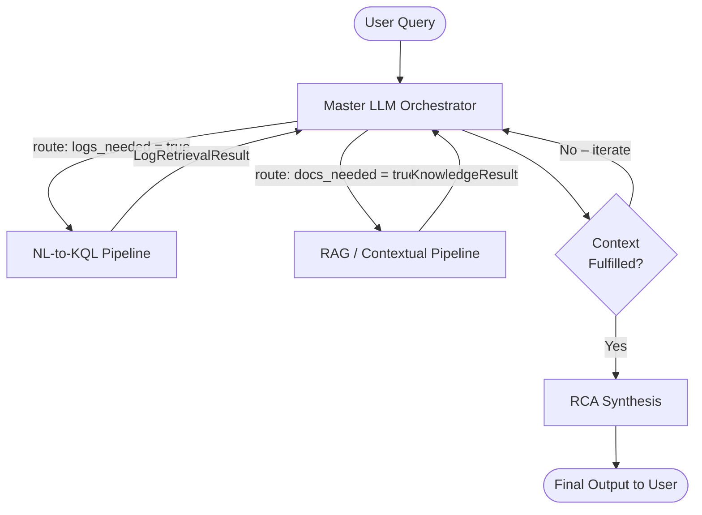
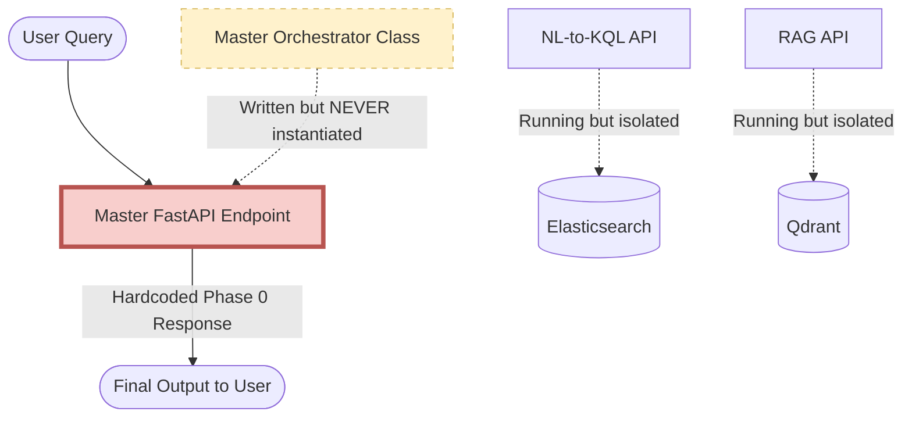

# NexGen: Comprehensive Code Audit, Architectural Assessment, and Remediation Strategy

*Document Generated For: AI Coding Agent Handoff*
*Status: CRITICAL (System is fundamentally non-operational despite superficial task completion)*

---

## 1. Executive Summary & Project Post-Mortem

The NexGen project was conceived as an autonomous, multi-agent observability framework capable of translating natural English queries into root-cause analyses (RCA) by intelligently querying Elasticsearch (for logs) and Qdrant (for runbooks and organizational knowledge). 

According to the project tracking document (`TASKS.md`), the project has successfully navigated through Phase 0 (Foundation), Phase 1 (Data Layer), Phase 2 (Core Retrieval), and almost all of Phase 3 (Advanced Features). Dozens of checkboxes are marked as `[x]`, implying a highly functional, production-ready system. 

**This is a dangerous illusion.**

The actual codebase is in a critical, fragmented, and highly brittle state. The fundamental requirement of Phase 0—that the three services can talk to each other and orchestrate a full request lifecycle—is functionally false. The `master` service is entirely disconnected from the data pipelines. The internal logic of the sub-services relies heavily on brittle parsing, unhandled edge cases, and in some cases, severe syntax and structural duplication errors resulting from poor version control or rushed AI generation.

This document serves as a brutally honest, exhaustive deep-dive (file-by-file) into the codebase to inform the next coding agent of exactly what needs to be fixed. It is intentionally detailed to provide all necessary context without requiring further exploratory reading.

---

## 2. Architectural Reality Check

### 2.1 The Expected Architecture (From `AGENTS.md`)

The system was designed to be a directed acyclic graph of intelligent routing:



### 2.2 The Actual Implemented Architecture

The reality is a set of isolated silos. The Master FastAPI endpoint returns a hardcoded string, completely bypassing the massive orchestrator class that was written for it.



---

## 3. Master Service Deep Dive

The Master service is the brain of the operation, tasked with coordinating the DAG and reasoning over the results. It is currently the most broken part of the system.

### 3.1 `master/src/main.py` (The Entrypoint Failure)

The `main.py` file is supposed to serve as the FastAPI entrypoint that instantiates the orchestrator and handles incoming HTTP requests.

**The Code as it exists:**
```python
@app.post("/query", response_model=RCAReport)
async def query(user_query: UserQuery) -> RCAReport:
    log = get_logger(service="master", query_id=user_query.query_id)

    # Downstream services would be called here
    return RCAReport(
        query_id=user_query.query_id,
        root_cause_summary="Not yet implement (Phase 0).",
        confidence=0.0,
        evidence=[
            RCAEvidenceItem(
                type="system",
                ref="master",
                snippet="Phase 0. Downstream calls not wired yet."
            )
        ],
        recommended_actions = ["Implement Master Orchestration pipeline."],
        reasoning_trace_summary="No reasoning here (Phase 0).",
        mttr_estimate_minutes=0,
        generated_at=datetime.now(timezone.utc)
    )
```

**Analysis:**
Despite `TASKS.md` claiming integration is partially done, the entrypoint is a pure stub. The `MasterOrchestrator` class (which contains hundreds of lines of logic) is not imported, instantiated, or used here. Any end-to-end testing of this system will immediately fail or falsely pass by reading this mocked data.

**Remediation:**
1. Import `MasterOrchestrator`.
2. Instantiate it in the `lifespan` context manager and attach it to `app.state`.
3. Rewrite the `/query` endpoint to `return await app.state.orchestrator.execute_query(user_query)`.

### 3.2 `master/src/orchestrator.py` (The Disconnected Brain)

This file contains the `MasterOrchestrator` class. It is visually impressive but fundamentally flawed in its initialization and execution flow.

**The Code:**
```python
        # Read API Keys uniquely overriding via .env safely ensuring compat checks hold true dynamically
        api_key = os.getenv("OPENAI_API_KEY", "dummy_key_or_actual_key")
        base_url = os.getenv("OPENAI_BASE_URL", "http://localhost:11434/v1")
        is_mock = os.getenv("MOCK_SERVICES", "false").lower() == "true"
        
        # Instantiate standard async payload provider for inference mapping or fallback seamlessly
        if is_mock and (api_key == "dummy_key_or_actual_key" or "dummy" in api_key):
            self.llm = None
        else:
            self.llm = AsyncOpenAI(api_key=api_key, base_url=base_url)

        # Initialize internal state classes
        self.session_manager = SessionManager(redis_url=os.getenv("REDIS_URL", "redis://localhost:6379/0"))
```

**Analysis:**
1. **Synchronous I/O in `__init__`:** It initializes the `SessionManager` which immediately attempts to connect to Redis. If Redis is down, the app crashes on boot.
2. **Fake Mocking:** The `is_mock` flag only disables the LLM. It still forces connections to external stores. There is no true "mock pathway" for integration testing.
3. **Topology Silencing:** The `_load_topology()` method attempts to read `config/topology.json`. If it doesn't exist, it sets `self.topology = {}` and silently moves on. Later, the `ValidatorAgent` relies on this topology to verify hypotheses. An empty topology means all hypotheses might either pass trivially or fail trivially.

**Remediation:**
Refactor initialization to be asynchronous. Implement a true mocking interface that completely bypasses outbound HTTP and Redis calls when `MOCK_SERVICES=true`.

### 3.3 `master/src/reasoner.py` (The Mini-ToT Implementation)

This file implements a Tree-of-Thoughts reasoning agent using Best-First Search.

**Analysis:**
```python
    async def reason(self, context: RCASynthesisInput) -> List[AcceptedHypothesis]:
        if not self.llm:
            return self._mock_reasoning_flow()
            
        # Depth 1: Generate initial branches (up to max_branches limit)
        initial_nodes = await self._generate_or_expand(context, "Initial Hypothesis Generation", depth=1)
```

The logic relies heavily on `self.llm.chat.completions.create` returning a perfectly formatted JSON array of hypotheses. If the LLM hallucinates the schema, the JSON parsing (`json.loads(raw.strip())`) will violently crash the Orchestrator loop. There is a bare `try/except` block that logs "ToT Expansion failed" and returns an empty list `[]`. If it returns an empty list, the orchestrator has no hypotheses and fails the entire query.

**Remediation:**
Implement robust Pydantic structured output parsing (e.g., via `instructor` or the native OpenAI structured outputs API) to guarantee schema adherence.

---

## 4. Query Service Deep Dive (NL-to-KQL Pipeline)

The Query service translates natural language into Elasticsearch queries. 

### 4.1 `query/src/validator.py` (The Recursive Descent Lie)

`TASKS.md` explicitly mandates: `Implement src/validator.py — KQLValidator (recursive-descent parser)`.

**The Code:**
```python
def _check_double_operators(kql: str) -> str | None:
    pattern = re.compile(
        r"\b(AND\s+AND|OR\s+OR|NOT\s+NOT|AND\s+OR|OR\s+AND)\b",
        re.IGNORECASE,
    )
    matches = list(pattern.finditer(kql))
    ...
```

**Analysis:**
This is **not** a recursive descent parser. It is a highly brittle collection of regex string replacements and simple stack bracket matching. It does not build an Abstract Syntax Tree (AST). 
Because it relies on Regex, it will fail catastrophically on edge cases. For example, a valid query like `message: "The operator AND was missing"` will trigger the double-operator regex or dangling boundary regex if not perfectly formatted, because the regex does not respect quoted string boundaries safely.

**Remediation:**
Either write a true tokenizer and recursive descent AST parser, or acknowledge the regex limitation and significantly strengthen the unit tests to cover quoted string edge cases.

### 4.2 `query/src/kql_dsl.py` (The Brittle Transpiler)

This file converts KQL into Elasticsearch Query DSL.

**The Code:**
```python
def _split_on_operator(expr: str, operator: str) -> list[str]:
    ...
    while i < len(expr):
        char = expr[i]
        if char in "({":
            depth += 1
            ...
        if depth == 0:
            remaining = expr[i:]
            pattern = rf"^{operator}(?=\s)"
            match = re.match(pattern, remaining, re.IGNORECASE)
```

**Analysis:**
This manually advances a character pointer `i` while attempting regex matches on substrings (`remaining = expr[i:]`). This is $O(N^2)$ string allocation overhead and extremely error-prone. More critically, it completely fails to account for escaped quotes or nested quotes within strings. 

**Remediation:**
A proper parsing library (like `lark` or `pyparsing`) must be introduced to securely tokenize and parse the KQL before transpiling it to the ES DSL.

---

## 5. RAG Service Deep Dive

The RAG pipeline is responsible for fetching organizational knowledge. It features the most egregious code errors in the repository.

### 5.1 `rag/src/compactor.py` (The Catastrophic Duplication)

This file is supposed to implement an `LLMLingua2Compactor`. However, an examination of the source code reveals a massive, file-breaking syntax error likely caused by an unresolved Git merge conflict or an aborted AI generation that appended code instead of replacing it.

**The Code Reality:**
Line 1 to 8 starts a docstring:
```python
"""LLMLingua-2 context compactor for the RAG pipeline.
...
"""LLMLingua-2 Compactor for context compression (rag.md §5.3).
```
Notice the `"""` colliding. 

Further down at line 47, a class is defined:
```python
class LLMLingua2Compactor:
    """Binary-token-classification compactor inspired by LLMLingua-2.
    ...
    def __init__(self, model_name: str | None = None) -> None:
```
Then, at line 124, right in the middle of a docstring/function, imports start again:
```python
import re
from typing import Any
...
class LLMLingua2Compactor:
    """Compresses a list of chunks into a budgeted text string.
    ...
    def __init__(self, settings: Settings) -> None:
```

**Analysis:**
The file contains two entirely different implementations of `LLMLingua2Compactor` concatenated together. One relies on `transformers` and raw PyTorch inference. The other attempts to import `llmlingua`. This file will not even compile successfully if loaded in certain Python environments due to the broken docstrings and duplicated scopes. It is a critical failure.

**Remediation:**
Delete `compactor.py` and rewrite it cleanly. Choose ONE implementation path (likely the `llmlingua` library wrapper) and ensure it handles the `Settings` injection properly.

### 5.2 `rag/src/debate.py` (The Silent Failure)

The `MultiAgentDebate` class resolves conflicts between RAG chunks.

**The Code:**
```python
        raise E007KnowledgeConflictUnresolved(
            f"Conflict between chunks {conflict.chunk_i.chunk_id} and "
            f"{conflict.chunk_j.chunk_id} unresolved after {self._max_rounds} "
            f"debate rounds."
        )
```

**Analysis:**
When the debate agents fail to output a valid `WINNER:` token after `max_rounds`, it raises `E007`. However, in `rag/src/main.py`, this exception is caught:

```python
            except Exception as exc:
                log.warning("debate_failed", error=str(exc))
                # On E007 or other failure, keep the higher-scoring chunk
                if pair.chunk_i.score >= pair.chunk_j.score:
                    ...
```

**Impact:**
The `AGENTS.md` spec explicitly states that `E007` should be returned to the Master Orchestrator so the master knows there is an unresolvable conflict. By silently catching it and arbitrarily picking the higher-scoring chunk, the RAG service destroys the very conflict-resolution guarantee it claims to provide. 

**Remediation:**
Modify the `try/except` block in `/knowledge` to propagate `E007` correctly in the `KnowledgeResult`'s `error` field, rather than silently dropping chunks.

---

## 6. Shared Infrastructure and Pydantic Schemas

### `nexgen_shared/schemas.py`
The schemas serve as the interface contracts. Because the `MasterOrchestrator` has never successfully sent a payload to `query/main.py` or `rag/main.py`, the schemas have never been truly tested in transit. 
It is highly probable that subtle serialization bugs exist (e.g., `datetime` parsing, or `UUID` string vs object serialization) which will immediately crash the system upon first integration.

---

## 7. Deployment, Docker, and The "Nuked" Environment

The `docker-compose.yml` file dictates an incredibly heavy stack:
- Elasticsearch (Java memory hog)
- Kibana
- Qdrant (Rust vector DB)
- Redis
- OpenTelemetry Collector
- Prometheus
- Grafana
- 3 FastAPI Python containers

**Analysis:**
Running this locally requires significant RAM (16GB+). The user explicitly noted they "nuked the environment", implying local execution of the testing harness failed or corrupted their setup. 

The immediate goal cannot be "fix the docker-compose setup." The immediate goal MUST be to establish a **Mock / Dev Mode** where the 3 Python services can run natively, bypassing all databases, communicating strictly via HTTP, and passing fixture JSONs back and forth to validate the business logic.

---

## 8. Actionable Roadmap for the Coding Agent

Do not attempt to solve all problems at once. Follow this strict sequence to achieve a Minimum Viable Product (MVP).

### Phase A: Rescue the Master Service
1. **Fix `main.py` Integration:** Connect the `MasterOrchestrator` to the FastAPI `/query` endpoint.
2. **Asynchronous Initialization:** Remove synchronous Redis connections from the Orchestrator's `__init__`.
3. **HTTP Client Setup:** Provide the Orchestrator with an `httpx.AsyncClient` so it can actually ping the Query and RAG services.

### Phase B: Fix the Critical Syntax Errors
1. **Rewrite `compactor.py`:** Resolve the massive file duplication/merge conflict in `rag/src/compactor.py`. Ensure only one implementation of `LLMLingua2Compactor` exists and that it compiles successfully.
2. **Fix `debate.py` Error Swallowing:** Ensure `rag/src/main.py` honors the `E007` contract instead of silencing it.

### Phase C: Implement the Mock Pathway
1. **Bypass Data Stores:** When `MOCK_SERVICES=true` is set, ensure that `ElasticsearchExecutor` and `DenseRetriever`/`SparseRetriever` return static JSON fixtures rather than attempting to connect to ES/Qdrant. 
2. **Test Orchestration Flow:** Run the three services locally (without Docker) and send a query to the Master. Verify the Master successfully splits the intent, queries both downstream services, receives the mocked fixtures, and synthesizes a final report.

### Phase D: Harden the Parsers
1. **Replace the Regex Parser:** Overhaul `query/src/validator.py` and `query/src/kql_dsl.py` to use a true parsing library (or drastically improve the regex safety) so that quoted strings don't crash the KQL transpiler.

---
*End of Report*
