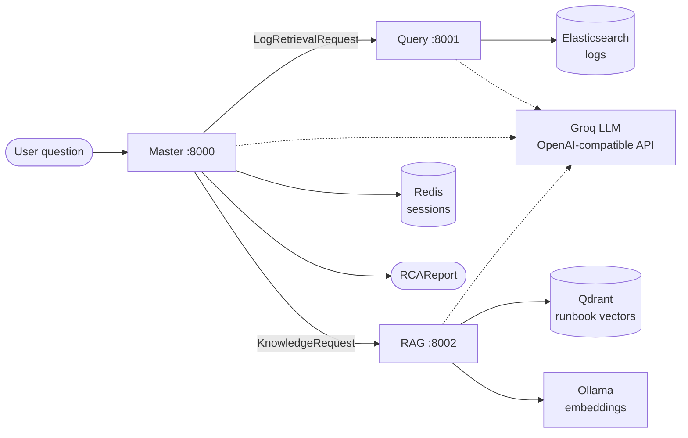

# NexGen — Study Guide

Everything you need to explain and defend this project: what it does, how a request flows, why each
design choice was made, what it costs, the numbers, and likely interview questions.

---

## 1. The 30-second pitch

> NexGen answers plain-English questions about production incidents, like *"Why is payments returning 500s?"*.
> It is three small services:
> - **Query** turns the question into an Elasticsearch log search, using an LLM to write KQL.
> - **RAG** finds the relevant runbooks.
> - **Master** combines both, works out which service caused the failure, checks that claim against a
>   service-dependency graph, and returns a root-cause report with evidence and a confidence score.
>
> The key idea: **rules find and verify the root cause; the LLM helps rank and explain it.** The LLM can't
> invent a culprit or a confidence number.

---

## 2. Architecture



| Piece | Job | Tech |
|---|---|---|
| `master/` | Orchestrates: route → fetch in parallel → reason → verify → report | FastAPI, asyncio, httpx |
| `query/` | Natural language → KQL → Elasticsearch → masked log lines | FastAPI, Elasticsearch client, LLM |
| `rag/` | Ingest runbooks, then hybrid search + re-rank + conflict check + compress | FastAPI, Qdrant, sentence-transformers, LLMLingua-2 |
| `nexgen_shared/` | The **only** code shared between services: Pydantic request/response models + error codes | Pydantic v2 |
| `tests/e2e/` | Runs the whole real stack on 24 incidents | bash + Python |

**Why microservices?**
- Each service has a different job, different dependencies (Elasticsearch vs Qdrant vs ML models) and was
  built by a different teammate.
- Each one can be developed, tested and replaced on its own.
- They share nothing but the JSON contracts in `nexgen_shared/schemas.py`. **Cost:** network calls, plus
  version and config drift. The end-to-end test found 6 bugs exactly at these seams (section 9).

---

## 3. One request, start to finish

Question: **"The gateway is returning 502s on checkout, find the root cause."** (incident `db-04`)

1. **Master / intent**: "find the root cause" matches the *causal* keywords, so the question needs both
   **logs and docs**. "gateway" is a known service, so it becomes the index hint `gateway-*`.
2. **Master / planner**:
   - Builds a small task graph: `FETCH_LOGS` and `FETCH_DOCS` with no dependencies, then `SYNTHESIZE`,
     which depends on both.
   - The log task asks for **all WARN/ERROR events**, not the literal question.
   - It searches gateway plus everything gateway depends on in `config/topology.json`: auth-service,
     payments, orders, db-primary, redis-cache, inventory.
3. **Master / executor**: sends both requests **at the same time** (`asyncio.gather`).
4. **Query**:
   - matches Master's hints (`gateway-*`, `payments-*`, …) to real indices and builds a prompt with the
     field names and 4 similar examples;
   - the LLM writes `log.level: ("ERROR" OR "WARN")`, and the validator checks it;
   - it's translated to Elasticsearch DSL and searched;
   - emails, IPs and tokens are masked, and the matching log lines are returned.
5. **RAG**:
   - embeds the question and runs dense and keyword search in Qdrant;
   - fuses the two rankings, re-ranks with a cross-encoder, and applies authority boosts;
   - checks the top docs for contradictions, compresses each one, and returns the top 5 with their source links.
6. **Master / context**: sorts the logs by time, drops repeated lines, and fits them into a token budget.
7. **Master / reasoner**:
   - Every service with a WARN/ERROR, or *named inside* another service's error, is a candidate.
     Ranked by who failed first: `redis-cache` (slow-command warnings at 10:10), then `db-primary`
     (shut down at 10:15:40), and so on.
   - With an LLM, the candidates are re-ranked after it reads the log lines. It moves `db-primary` to the
     top, because the redis warnings are just background noise.
8. **Master / validator**: is `db-primary` reachable from `gateway` in the topology? (yes) Did it fail no
   later than the gateway's first error? (yes) Is it mentioned in the evidence? (yes) → **accepted**.
9. **Master / synthesiser**:
   - Computes the confidence in code and builds the evidence list.
   - The first evidence item is `{"type": "root_cause", "ref": "service:db-primary"}`.
   - The LLM writes the summary sentence and the recommended actions.

Result: *db-primary was the root cause*, correct, in about 3–6 s on the real stack.

---

## 4. Master (`master/src/`, about 1,100 lines)

| Step | File | What it does | Why this way |
|---|---|---|---|
| Intent | `intent.py` | Regex keyword groups (count / why / how-to / symptom words) pick the route; the LLM is asked only if no rule matches | Instant, free, predictable (95% on 40 test questions); the LLM is a fallback, not a dependency |
| Planner | `planner.py` | DAG of fetch tasks + a synthesis task; widens index hints to everything the service depends on | Failures come from *downstream*, so the culprit's logs must be fetched too |
| Executor | `executor.py` | Runs fetch tasks concurrently; a failed call becomes a `failure` result with code E003/E004 | Parallel = latency of the slowest call, not the sum; one dead service doesn't crash the answer |
| Context | `context.py` | Enough data? Sort by time, de-duplicate, cut to a token budget (tiktoken) | Prompts stay small; repeated lines add cost, not information (saved 22% of tokens) |
| Reasoner | `reasoner.py` | Candidates ranked by first problem time; optional LLM re-rank **limited to the candidate list** | "First to fail" is how SREs reason; restricting the LLM stops it inventing services |
| Validator | `validator.py` | Topology reachability (E008), timing, grounding; the first candidate that passes all three wins | Deterministic checks catch LLM or rule mistakes and are easy to explain |
| Synthesiser | `synthesiser.py` | Confidence formula, evidence list, template text or LLM text | Facts from code, wording from the LLM |
| Session | `session.py` | Last 20 messages in Redis, falling back to memory | Multi-turn history; the demo works without Redis |
| Topology | `topology.py` + `config/topology.json` | Who-calls-whom graph; breadth-first reachability search | The core "safety net" against wrong blame |
| Fixtures | `fixtures.py` | With `MOCK_SERVICES=true`, serves logs and docs from `data/scenarios.json` | Develop and benchmark Master alone, quickly and reproducibly |

**Confidence** = `0.6 × log_support + 0.3 × doc_support + 0.1 × topology_ok`
- `log_support`: share of WARN/ERROR lines that come from or mention the culprit.
- `doc_support`: share of retrieved docs that mention the culprit.
- `topology_ok`: 1 when the hypothesis passed validation.
- Logs get the most weight because they're direct evidence. Docs only corroborate.

**Topology check, in one sentence:** if gateway never calls notifications (directly or indirectly), a
notifications failure can't explain gateway errors, so that hypothesis is rejected with E008.

---

## 5. Query (`query/src/`, NL → KQL)

`schema_linker → few_shot → generator → validator ⇄ repair → kql_dsl → executor → pii`

| Stage | What | Why |
|---|---|---|
| `schema_linker.py` | Caches every index's field mappings (refreshed every 5 min). Picks indices by Master's hints like `payments-*`, otherwise all | The LLM must only see real field names, or it invents fields like `status_code` |
| `few_shot.py` | Picks the 4 examples (of 29) sharing the most words with the question | Examples teach the KQL style. With 29 examples, word overlap is good enough and needs no vector DB |
| `generator.py` | LLM prompt = KQL rules + schema fields + examples + question | Fields + examples ground the model |
| `validator.py` | Balanced brackets, no `AND AND`, no dangling operators, values after colons, **field names exist** | Cheap checks catch bad KQL before it reaches Elasticsearch |
| `repair.py` | Feeds validator errors back to the LLM, at most 3 attempts, then E002 | Self-correction: most errors get fixed on the second try |
| `kql_dsl.py` | Translates KQL into Elasticsearch Query DSL | The ES `_search` API takes DSL, not KQL |
| `executor.py` | Runs the search | — |
| `pii.py` | Regex masking: emails, IPs, JWTs, AWS keys, card numbers, phones, hashes | Personal data must never reach the LLM or the user |

**Why KQL rather than having the LLM write DSL directly?** KQL is short and close to natural language, so
an LLM writes it more reliably than nested JSON. It's also easy to validate with simple checks.

---

## 6. RAG (`rag/src/`)

**Ingest** (`POST /ingest`): markdown in `data/docs/` with front-matter (`doc_id`, `source_uri`,
`authority_tier`) goes through these steps:
1. **Chunk:** 512-word windows with 64-word overlap for runbooks; Jira and Slack are split differently.
2. **Tag technical IDs:** IPs, trace IDs, hashes, paths and error codes are wrapped as `<TAG:value>`.
3. **Store two vectors per chunk in Qdrant:**
   - a dense embedding (`nomic-embed-text`, 768 dimensions, via Ollama);
   - a sparse keyword vector (hashed term frequencies).

**Query** (`POST /knowledge`):

| Stage | File | What | Why |
|---|---|---|---|
| Time filter | `temporal.py` | Ignore docs created after the incident time | A runbook written *after* the incident can't have been used during it |
| Dense search | `dense.py` | Embedding similarity | Finds paraphrases ("DB down" ≈ "connection refused") |
| Sparse search | `sparse.py` | Keyword match on hashed tokens | Finds exact IDs and error codes that embeddings blur |
| Fusion | `fusion.py` | **Weighted Reciprocal Rank Fusion**: `w/(k+rank)`, k=60. Weights 0.3/0.7 for technical queries (error codes, IDs, paths), 0.7/0.3 for natural language | Combines both rankings without comparing raw scores on different scales |
| Re-rank | `reranker.py` | Cross-encoder `ms-marco-MiniLM-L-6-v2` scores each (question, chunk) pair | Reads question and chunk together, so it's more accurate than vector similarity. Only run on the top 2×k, because it's slow |
| Authority | `authority.py` | `sigmoid(rerank score) × 1.25 for tier A × 1.15 for accepted answers × 0.3 if deprecated` | Formal runbooks beat Slack guesses |
| Conflicts | `conflict.py` | NLI cross-encoder labels every pair of top chunks; contradiction with confidence > 0.8 = conflict | Two docs giving opposite advice is dangerous |
| Debate | `debate.py` | Two LLM "agents" each defend one chunk, and an aggregator picks one or merges them (≤3 rounds). If it fails, keep the higher-ranked chunk | An explainable way to resolve a contradiction |
| Compression | `compactor.py` | LLMLingua-2 keeps the important tokens within a budget, **per chunk** so each keeps its source link | Fits more knowledge into Master's prompt |
| ID preservation | `id_preservation.py` | Re-inserts any `<TAG:…>` the compressor dropped | Compression must never delete a trace ID or error code |

`MIN_RELEVANCE_SCORE` (a re-ranker cut-off) exists but is **off by default**. The cross-encoder returns
raw logits whose range depends on the documents. Our clearly relevant runbooks score around −7 to −11,
so the old fixed cut-off of −2 silently dropped everything.

---

## 7. The shared contract (`nexgen_shared/`)

- `schemas.py`: `UserQuery`, `LogRetrievalRequest/Result`, `KnowledgeRequest/Result`, `RCAReport` and
  related models. Each service validates what it sends and receives against these Pydantic models.
- `errors.py`: stable codes, so failures are machine-readable:

  | Code | Meaning |
  |---|---|
  | E001 | No matching index |
  | E002 | KQL still invalid after repair |
  | E003 | Elasticsearch failure |
  | E004 | Vector store failure |
  | E005 | LLM timeout |
  | E006 | Context too large |
  | E007 | Conflict unresolved |
  | E008 | Topology rejected the claim |

- **Why a shared package rather than copying the models?** One definition means a contract change shows up
  as a type error, not a silent bug in production.

---

## 8. Design trade-offs (the "why this, not that" table)

| Decision | Alternative | Why we chose it | What it costs |
|---|---|---|---|
| Rules + verification first, LLM second | Let the LLM do the whole RCA | Reproducible, cheap, explainable; can't hallucinate a culprit | Rules miss things the LLM would catch (the red herrings) |
| LLM may only **reorder** candidates | Free-text LLM answer | Every answer is grounded in the evidence | It can't find a culprit that never appears in the logs |
| Topology graph check | Trust the ranking | Deterministic, catches "blamed an unrelated service" | The graph must be maintained by hand |
| Confidence from a formula | Ask the LLM for confidence | LLM confidence isn't calibrated; a formula is explainable | The weights (0.6/0.3/0.1) are judgement calls, not learned |
| Parallel fetch | Sequential | Latency = slowest call, not the sum | Slightly more complex error handling |
| Ask Query for *all* WARN/ERROR logs | Pass the user's literal question | The question would filter out the culprit's logs | More log lines to process (solved by de-duplication + budget) |
| Hybrid dense + keyword search | Dense only | Exact IDs and error codes need keywords; paraphrases need embeddings | Two indexes, plus fusion |
| Rank fusion (RRF) | Add the raw scores | Dense and sparse scores aren't on the same scale | Ignores score gaps (only ranks count) |
| Cross-encoder re-rank of the top 2k only | Re-rank everything | Accurate but slow; the top candidates are enough | Something ranked low by both searches is never seen |
| Per-chunk compression | Merge all docs into one blob | Keeps citations correct | Each chunk gets a smaller token budget |
| Word-overlap few-shot (Query) | Embeddings + vector DB | 29 examples don't need a vector DB; one less service | Weaker on paraphrased questions |
| Hosted LLM (Groq, OpenAI-compatible API) | Local llama.cpp / Ollama | Laptop has 8 GB RAM; any provider is a config change | Rate limits (8k tokens/min, 200k/day on the free tier) and network dependency |
| Pydantic contracts in a shared package | Each service defines its own | One source of truth | Every service must reinstall when it changes |
| Fixture mode in Master | Always use real services | Fast, reproducible benchmark; Master developed alone | Fixture numbers aren't real-stack numbers (so the e2e test exists too) |

---

## 9. Numbers (and exactly how they were measured)

**Master benchmark** (`master/eval/RESULTS.md`): 24 hand-written incidents, with Query and RAG replaced by fixtures.
The incidents come in 3 kinds:
- 12 normal;
- 6 *traps*, with noise from a service the symptom can't depend on;
- 6 *red herrings*, with noise from a service it *does* depend on.

| | Rules only | Rules + LLM (gpt-oss-20b) |
|---|---|---|
| Routing accuracy (40 questions) | 38/40 (95%) | 38/40 |
| Root cause, top candidate, no validator | 12/24 | 24/24 |
| Root cause, final (after validator) | 17/24 | 24/24 |
| Red herrings solved | 0/6 | 6/6 |
| Prompt tokens saved by de-duplication | 21.7% | 21.7% |
| Latency p50 | <1 ms | 1.8 s |

Story: the rules solve the normal cases → the topology validator fixes the traps (50% → 71%) → the LLM
solves the red herrings (→ 24/24).

**Full real stack** (`tests/e2e/RESULTS.md`): the same 24 incidents through Elasticsearch, Qdrant,
Query, RAG and Groq. **24/24** correct, p50 **2.8 s**, p95 **7.4 s**, 18/24 answers cited a runbook.

**RAG evaluation** (`rag/tests/eval/RESULTS.md`): 20 questions over 14 docs, RAGAS-style:

| Metric | Score | Target |
|---|---|---|
| Context precision | 0.925 | ≥ 0.75 |
| Context recall | 0.95 | (none) |
| Faithfulness | 1.0 | ≥ 0.80 |
| Noise sensitivity | 0.104 | ≤ 0.20 |

- **Precision and recall** use labelled relevant docs.
- **Faithfulness:** an LLM answers from the retrieved chunks, then an LLM judge checks each claim.
- **Noise sensitivity:** two misleading "documents" are injected, and the judge counts the wrong claims.

**Be honest about these:**
- The incidents are synthetic and small, and the rules-only split is largely by design.
- 24/24 says "works on this set", not "works in production".
- The e2e run happened before the last two RAG changes (cut-off off by default, authority sigmoid);
  rerun `tests/e2e/run.sh` to refresh it.

**Bugs found only by running everything together** (great interview story):
1. Query crashed on Master's request format: it called `.get()` on a Pydantic model.
2. Query didn't declare the shared package as a dependency.
3. The Elasticsearch client v9 and the newer Qdrant client didn't work with the 8.x / 1.9 servers →
   pinned the client versions.
4. RAG searched a different embedding endpoint than it used for ingestion.
5. RAG merged all docs into one chunk, so every citation was wrong.
6. Master passed the literal question as the log search, which hid the culprit's logs.

Also found during cleanup: the authority boost **lowered** formal docs when re-rank scores were negative
(fixed with a sigmoid), and Query always reported 0 repair attempts (fixed).

---

## 10. Known limitations (say them before the interviewer does)

- **Data:** small, synthetic evaluation sets; no real production logs.
- **Topology:** the dependency graph is maintained by hand.
- **Sparse search:** keyword vectors are term frequency only (no IDF), i.e. a simplified BM25.
- **Dates:** RAG missed "August 5" vs "2026-08-05", because there's no date normalisation.
- **Debate:** it only runs if RAG has a chat LLM configured. Without one, it falls back to keeping the
  higher-ranked chunk.
- **Rank fusion:** the dense/sparse weights are fixed heuristics, not tuned.
- **Security:** no auth between services; index access control was planned but not built.
- **Docker:** `docker compose` defines all services, but the day-to-day path is `tests/e2e/run.sh`.

---

## 11. Running it

```bash
# Master alone (no other services needed)
cd master && cp .env.example .env && uv sync
MOCK_SERVICES=true uv run uvicorn src.main:app --port 8000
uv run python eval/run_eval.py --mode rules      # or --mode llm (needs OPENAI_API_KEY)

# Whole stack (Docker + Ollama + Groq key in master/.env)
tests/e2e/run.sh --limit 3

# RAG evaluation
rag/scripts/eval.sh

# Tests
cd master && uv run pytest            # 46
cd query  && uv run pytest            # 167 (+5 skipped without ES/LLM)
cd rag    && uv run pytest            # 67 (+1 opt-in eval)
```

---

## 12. Interview questions

1. **Walk me through a request.** → Section 3.
2. **Why not just give the logs to GPT and ask for the root cause?** It may blame a service that doesn't
   exist or can't be involved, and it can't tell you how sure it is. Here the LLM only reorders real
   candidates, and code verifies the result.
3. **How does the topology check work?** A breadth-first search over `topology.json`. If the symptom service
   can't reach the culprit, the claim is impossible (E008).
4. **What if two candidates both pass?** The validator takes the first in rank order, so the ranking
   (first-to-fail, or the LLM re-rank) decides.
5. **Why rank by "first to fail"?** Failures propagate upstream over time, so the cause usually fails first.
   The weakness is unrelated earlier noise, which is exactly the red-herring set the LLM fixes.
6. **How is confidence computed? Why not ask the LLM?** With the formula in section 4. LLM confidence
   isn't calibrated, and a formula can be explained.
7. **Why hybrid search?** Embeddings match meaning but blur exact tokens like `ERR_DB_CONN_REFUSED`;
   keyword search is the opposite. RRF combines the two rankings without needing comparable scores.
8. **What does the cross-encoder add over embeddings?** A bi-encoder embeds the question and the doc
   separately. A cross-encoder reads them together, which is more accurate but slower, so it's only used
   to re-rank a short list.
9. **What is NLI conflict detection?** Natural Language Inference labels a pair of texts as contradiction,
   entailment or neutral. Contradicting top chunks trigger a debate.
10. **Why compress context, and how do you avoid losing IDs?** LLMLingua-2 drops low-information tokens to
    fit the budget. Technical IDs are tagged at ingest and re-inserted if they get dropped.
11. **How do you stop the LLM writing bad KQL?** Schema-grounded prompt, few-shot examples, a validator,
    then a repair loop that feeds the errors back (up to 3 tries).
12. **How do you protect personal data?** Query masks emails, IPs, tokens and so on before any log line
    leaves the service, so the LLM never sees them.
13. **What happens if Query or RAG is down?** The executor returns a structured failure (E003/E004). Master
    returns a zero-confidence report explaining why, instead of crashing or guessing.
14. **How did you evaluate it?** Section 9: a fixture benchmark with ablations, a full-stack test, and a
    RAGAS-style RAG evaluation.
15. **What was the hardest bug?** RAG returned zero documents for every normal question. The re-ranker
    cut-off was −2.0, but relevant docs scored around −8. Only running the real stack showed it.
16. **What would you do next?**
    - a real incident set and a learned ranker;
    - IDF in the sparse vectors, and date normalisation;
    - generating the topology from tracing data;
    - auth between services.
17. **Why microservices for a project this size?** The three parts have different dependencies and owners.
    The cost is integration bugs, and the end-to-end test exists to catch them.
18. **How do you handle LLM rate limits?** Retries with capped back-off, a hard per-call deadline,
    low reasoning effort, and pacing in the eval scripts.

---

## 13. Ownership (be ready for "which part did you build?")

From git history:
- **RAG:** mostly you (Vedant2005goyal) and Nandan Verma.
- **Query:** mostly Sarishti and dishav-preet.
- **Master:** first version by B4S1C-Coder. It was rewritten, along with the integration fixes, the
  benchmark and the end-to-end test, on the `fix-rag-emoji-and-relevance` branch.

Claim what you built, and describe the rest as the team's design you integrated and understand.

## 14. Glossary

| Term | Meaning |
|---|---|
| **KQL** | Kibana Query Language, a short query syntax for Elasticsearch |
| **DSL** | Elasticsearch's JSON query format |
| **RCA** | Root-cause analysis |
| **DAG** | Directed acyclic graph (tasks with dependencies) |
| **RRF / WRRF** | (Weighted) Reciprocal Rank Fusion: combine rankings by `1/(k+rank)` |
| **Bi-encoder vs cross-encoder** | Embed texts separately vs score the pair together |
| **NLI** | Natural Language Inference: contradiction / entailment / neutral |
| **LLMLingua-2** | A small model that decides which tokens to keep when compressing a prompt |
| **RAGAS** | A standard set of RAG metrics (context precision/recall, faithfulness, noise sensitivity) |
| **Few-shot** | Example input → output pairs placed in the prompt |
| **p50 / p95** | Median and 95th-percentile latency |
