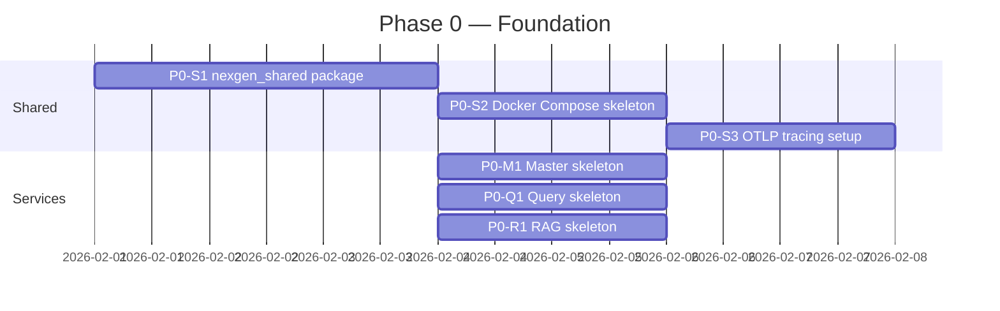

# TASKS.md — NexGen: Phased Engineering Task List

> **Critical Rule for AI Coding Agents:** Pick exactly **one** incomplete task, complete it fully (code + tests + docstring), mark it `[x]`, and stop. Do not begin the next task in the same turn.

> **Status legend:** `[ ]` = not started · `[~]` = in progress · `[x]` = complete · `[!]` = blocked

> **Component prefix:** `[SHARED]` · `[MASTER]` · `[QUERY]` · `[RAG]`

---

## Phase 0 — Foundation & Shared Infrastructure

> Goal: All three services can start, talk to each other, and agree on data shapes.

### Shared

- [x] **P0-S1** `[SHARED]` Create `nexgen_shared/` Python package with:
  - `schemas.py` — all Pydantic v2 models from `AGENTS.md §5` (`UserQuery`, `LogRetrievalRequest`, `LogRetrievalResult`, `KnowledgeRequest`, `KnowledgeResult`, `RCASynthesisInput`, `RCAReport`)
  - `errors.py` — `NexGenError` base exception class; one subclass per error code E001–E008
  - `logging.py` — `structlog` configuration helper returning a bound logger with `service` and `query_id` fields pre-attached
  - Unit tests: every schema serialises/deserialises a round-trip without data loss

- [x] **P0-S2** `[SHARED]` Create `docker-compose.yml` defining services:
  - `elasticsearch` (8.x, single-node)
  - `kibana`
  - `qdrant`
  - `redis`
  - `otel-collector` (receives OTLP gRPC on 4317)
  - `prometheus` + `grafana`
  - `master`, `query`, `rag` (each built from their local `Dockerfile`)
  - Shared network `nexgen-net`; volumes for ES data, Qdrant storage, Redis data

- [x] **P0-S3** `[SHARED]` Create `nexgen_shared/tracing.py`:
  - `configure_tracer(service_name: str) -> Tracer` — initialises OpenTelemetry with OTLP gRPC exporter
  - Decorator `@traced(span_name)` that wraps an async function in an OTel span
  - Unit test: verify span is created and contains `service.name` attribute

### Master LLM Orchestrator

- [x] **P0-M1** `[MASTER]` Scaffold the `master/` service:
  - `pyproject.toml` (deps: `fastapi`, `uvicorn`, `httpx`, `pydantic-settings`, `redis[hiredis]`, `nexgen_shared`)
  - `.env.example` (copy from `master.md §5`)
  - `src/main.py` — FastAPI app with lifespan, three stub endpoints:
    - `POST /query` → returns a hardcoded `RCAReport` with `confidence=0.0`
    - `GET /health` → `{"status": "ok", "service": "master"}`
    - `GET /session/{session_id}` → `{"session_id": session_id, "history": []}`
  - `Dockerfile` (multi-stage, Python 3.12-slim)
  - Integration test: `GET /health` returns 200

### NL-to-KQL Pipeline

- [x] **P0-Q1** `[QUERY]` Scaffold the `query/` service:
  - `pyproject.toml` (deps: `fastapi`, `uvicorn`, `httpx`, `elasticsearch[async]`, `qdrant-client`, `pydantic-settings`, `nexgen_shared`)
  - `.env.example` (copy from `query.md §5`)
  - `src/main.py` — FastAPI app with:
    - `POST /retrieve` → stub returning `LogRetrievalResult(status="success", hits=[], hit_count=0)`
    - `GET /health` → `{"status": "ok", "service": "query"}`
    - `GET /schema-cache/status` → `{"last_refreshed": null, "index_count": 0}`
  - `Dockerfile`
  - Integration test: `GET /health` returns 200

### RAG / Contextual Pipeline

- [x] **P0-R1** `[RAG]` Scaffold the `rag/` service:
  - `pyproject.toml` (deps: `fastapi`, `uvicorn`, `httpx`, `qdrant-client`, `pydantic-settings`, `nexgen_shared`, `sentence-transformers`, `transformers`)
  - `.env.example` (copy from `rag.md §8`)
  - `src/main.py` — FastAPI app with:
    - `POST /knowledge` → stub returning `KnowledgeResult(status="success", chunks=[])`
    - `GET /health` → `{"status": "ok", "service": "rag"}`
    - `POST /ingest` → stub returning `{"status": "accepted"}`
  - `Dockerfile`
  - Integration test: `GET /health` returns 200

---

## Phase 1 — Core Data Layer

> Goal: Elasticsearch indexing works; Qdrant collections exist; schema cache is live.

### NL-to-KQL Pipeline

- [x] **P1-Q1** `[QUERY]` Implement `src/schema_linker.py` — `SchemaContext`, `FieldMeta` dataclasses; `SchemaLinker` class that:
  - On startup, fetches all index mappings from Elasticsearch via `GET /_mapping` and stores them in `_cache: dict[str, list[FieldMeta]]`
  - Exposes `async def refresh_cache()` refreshed on a background task every `SCHEMA_CACHE_REFRESH_INTERVAL_SECONDS`
  - Exposes `async def link(natural_language: str, index_hints: list[str], schema_context_from_request: dict) -> SchemaContext`
  - Correctly marks `is_nested=True` for fields of ES type `nested`
  - Unit tests: nested field annotation; index-hint filtering; cache refresh updates `last_refreshed`

- [x] **P1-Q2** `[QUERY]` Implement `src/executor.py` — `ElasticsearchExecutor`:
  - Initialise `AsyncElasticsearch` client from env config
  - `async def execute(kql: str, schema_ctx: SchemaContext, max_results: int) -> tuple[list[dict], int]` — returns (hits, total)
  NOTE: Implemented as ExecutorResult dataclass instead of tuple to also
  carry timed_out and shards_failed fields needed for status="partial" logic.
  - `kql_dsl.py` — minimal KQL→DSL transpiler handling: term queries (`field: "value"`), range queries (`@timestamp >= now-1h`), boolean AND/OR/NOT, pipe chain stripping
  - On `ConnectionError` raise `NexGenError("E003")`
  - Integration test (requires running ES): simple term query returns expected document from a seeded index

- [x] **P1-Q3** `[QUERY]` Create Qdrant collections for few-shot examples:
  - Script `scripts/init_qdrant.py` that creates `nexgen_few_shot` collection (768-dim, cosine)
  - `data/fallback_examples.jsonl` — at least 10 diverse NLQ→KQL pairs covering: time-range filter, service filter, log-level filter, nested field, aggregation count, multi-field AND, multi-field OR
  - Script `scripts/seed_few_shot.py` that embeds and upserts `fallback_examples.jsonl` into Qdrant
  - Unit test: Qdrant collection exists after running init script

### RAG / Contextual Pipeline

- [x] **P1-R1** `[RAG]` Implement `src/connectors/base.py` and `src/connectors/local_file.py`:
  - `BaseConnector` ABC as specified in `rag.md §3.1`
  - `RawDocument` dataclass
  - `LocalFileConnector` — reads `.md`, `.txt`, `.pdf` files from `data/docs/`; uses `python-frontmatter` for YAML metadata; falls back to filename for `source_uri`
  - Unit tests: `LocalFileConnector.fetch()` returns `RawDocument` list for a directory of 3 fixture files

- [ ] **P1-R2** `[RAG]` Implement `src/preprocessor.py` — `Preprocessor` class:
  - `chunk(doc: RawDocument) -> list[ProcessedChunk]` using strategy table from `rag.md §3.2`
  - `tag_technical_ids(text: str) -> str` — applies all regex patterns from `rag.md §3.2` (IP, trace ID, hash, path, error code)
  - `enrich_metadata(chunk: ProcessedChunk, doc: RawDocument) -> ChunkMetadata` — assigns authority tier, resolution status, recency score (`recency_score = 1.0` at index time; decayed at query time)
  - Skip `disentangle` for non-Slack sources (stub `disentangle` to identity for now)
  - Unit tests: IP address tagged; chunk count within expected range for a 1000-token runbook; authority tier assigned correctly per source type

- [ ] **P1-R3** `[RAG]` Create Qdrant collections and implement `POST /ingest` endpoint:
  - Script `scripts/init_qdrant_rag.py` — creates `nexgen_dense` (768-dim, cosine) and `nexgen_bm25_terms` (sparse) collections
  - Implement `POST /ingest` handler that: calls the target connector, passes docs through `Preprocessor`, embeds via `nomic-embed-text` (Ollama), upserts into `nexgen_dense`; stores BM25 term vectors in `nexgen_bm25_terms`
  - Integration test: ingest 5 fixture docs → Qdrant `nexgen_dense` point count increases by expected chunk count

---

## Phase 2 — Core Retrieval & Generation

> Goal: End-to-end KQL generation works; end-to-end RAG retrieval works. Both services return real data.

### NL-to-KQL Pipeline

- [x] **P2-Q1** `[QUERY]` Implement `src/few_shot.py` — `FewShotSelector`:
  - `async def select(natural_language: str, schema_ctx: SchemaContext) -> list[FewShotExample]`
  - Embeds query, queries Qdrant `nexgen_few_shot`, filters by index pattern, returns top-k
  - Falls back to `fallback_examples.jsonl` when fewer than 2 results above threshold
  - Unit tests: returns ≤ `FEW_SHOT_K` examples; cold-start fallback triggered correctly

- [x] **P2-Q2** `[QUERY]` Implement `src/generator.py` — `KQLGenerator`:
  - Loads prompt template from `prompts/generator.txt`
  - Calls Ollama with `QUERY_LLM_MODEL`, temperature 0.05
  - Strips any markdown fences from response
  - Unit test (mocked Ollama): prompt contains schema fields and few-shot examples; output is non-empty string without backticks

- [ ] **P2-Q3** `[QUERY]` Implement `src/validator.py` — `KQLValidator` (recursive-descent parser):
  - Parse field existence, balanced parens, operator validity, nested structure
  - Return `ValidationResult(valid, errors, ast)`
  - Unit tests: 5 valid KQL strings → `valid=True`; 5 invalid strings (missing paren, bad operator, hallucinated field) → `valid=False` with descriptive errors

- [ ] **P2-Q4** `[QUERY]` Implement `src/repair.py` — `RepairAgent`:
  - Loads `prompts/repair.txt`
  - Retry loop up to `MAX_REPAIR_ATTEMPTS`; raises `NexGenError("E002")` on exhaustion
  - Tracks `refinement_attempts` counter
  - Unit test (mocked Ollama + mocked validator): first attempt invalid → second attempt valid → counter = 2

- [ ] **P2-Q5** `[QUERY]` Implement `src/pii.py` — `PIIMasker`:
  - All regex patterns from `query.md §3.7`
  - `mask(hits: list[dict]) -> list[dict]` applies patterns to all string values in hit dicts recursively
  - Preserves trace IDs as `<TRACE_ID:value>` rather than deleting them
  - Unit tests: IPv4 masked; email masked; trace ID preserved; clean hit unchanged

- [ ] **P2-Q6** `[QUERY]` Wire `POST /retrieve` endpoint end-to-end:
  - Calls `SchemaLinker → FewShotSelector → KQLGenerator → KQLValidator → (RepairAgent if invalid) → ElasticsearchExecutor → PIIMasker → ResultFormatter`
  - All steps instrumented with `@traced` spans
  - Integration test (requires ES + Ollama): POST with real NLQ returns `LogRetrievalResult` with `status != "failure"`

### RAG / Contextual Pipeline

- [ ] **P2-R1** `[RAG]` Implement `src/temporal.py` — `TemporalFilter`:
  - `build_qdrant_filter(request: KnowledgeRequest) -> models.Filter` — Qdrant payload filter excluding docs after `not_after`
  - `apply_recency_decay(chunks: list[RankedChunk], lambda_: float) -> list[RankedChunk]` — modifies `score` in-place using exponential decay formula from `rag.md §4.1`
  - Unit tests: doc with `created_at` after `not_after` excluded; recency decay reduces score for 50-day-old doc to ~37 % of original

- [ ] **P2-R2** `[RAG]` Implement `src/dense.py` — `DenseRetriever`:
  - Embed query via Ollama `nomic-embed-text`
  - Query `nexgen_dense` with Qdrant filter from `TemporalFilter`
  - Return `list[RankedChunk]` with raw similarity scores
  - Unit test (requires running Qdrant with seeded data): known query returns known doc in top-3

- [ ] **P2-R3** `[RAG]` Implement `src/sparse.py` — `SparseRetriever`:
  - Compute BM25 term weights for query tokens
  - Query `nexgen_bm25_terms` sparse index
  - Return `list[RankedChunk]`
  - Unit test: query containing exact error code surfaces doc with that error code in top-1

- [ ] **P2-R4** `[RAG]` Implement `src/fusion.py` — `WRRFFusion`:
  - `classify_query(query: str) -> tuple[float, float]` — returns `(w_dense, w_sparse)` using rule-based scorer
  - `fuse(dense: list[RankedChunk], sparse: list[RankedChunk], w_dense, w_sparse) -> list[RankedChunk]`
  - Unit tests: natural-language query → `w_dense=0.7`; error-code-heavy query → `w_sparse=0.7`; fused list is deduplicated and sorted by WRRF score

- [ ] **P2-R5** `[RAG]` Implement `src/reranker.py` — `CrossEncoderReranker`:
  - Load `cross-encoder/ms-marco-MiniLM-L-6-v2` via `sentence-transformers`
  - `rerank(query: str, chunks: list[RankedChunk]) -> list[RankedChunk]` — replaces `score` with cross-encoder score; sorted descending
  - Unit test: a chunk containing the exact query terms ranked higher than an off-topic chunk

- [ ] **P2-R6** `[RAG]` Implement `src/authority.py` — `AuthorityScorer`:
  - `score(chunks: list[RankedChunk]) -> list[RankedChunk]` applies formula from `rag.md §4.6`
  - Unit tests: Tier-A runbook scores higher than equivalent Tier-B Slack chunk; deprecated chunk has lowest score regardless of other boosts

- [ ] **P2-R7** `[RAG]` Wire `POST /knowledge` endpoint (no conflict detection yet):
  - Calls `TemporalFilter → DenseRetriever + SparseRetriever (parallel) → WRRFFusion → CrossEncoderReranker → AuthorityScorer → top-max_chunks`
  - Set `conflict_detected=False` temporarily
  - Assemble `KnowledgeResult` with raw chunks (no compression yet)
  - Integration test: POST with semantic query returns `KnowledgeResult` with ≥ 1 chunk from seeded docs

---

## Phase 3 — Advanced Features

> Goal: Conflict resolution, context compaction, Master reasoning loop all work.

### RAG / Contextual Pipeline

- [ ] **P3-R1** `[RAG]` Implement `src/conflict.py` — `ConflictDetector`:
  - Load `cross-encoder/nli-deberta-v3-small`
  - Pairwise NLI over top-k chunks; collect `ConflictPair` list for CONTRADICTION above threshold
  - Unit test: two fixture chunks with known contradiction → 1 ConflictPair detected

- [ ] **P3-R2** `[RAG]` Implement `src/debate.py` — `MultiAgentDebate`:
  - Two LLM agents (evidence-constrained prompts from `prompts/debate_agent.txt`)
  - Aggregator agent (`prompts/debate_aggregator.txt`) decides WINNER or MERGE
  - Max 3 rounds; raises `NexGenError("E007")` on max rounds exhausted
  - Unit test (mocked LLM): aggregator output contains `WINNER:` token; merged summary ≤ 200 tokens

- [ ] **P3-R3** `[RAG]` Implement `src/compactor.py` — `LLMLingua2Compactor`:
  - Load LLMLingua-2 BERT model
  - `compress(chunks: list[str], budget_tokens: int) -> str` — binary token classification; iterative ratio adjustment
  - Enforce `<TAG:value>` patterns as always-preserve via pre-pass
  - Unit test: output token count ≤ budget + 5 %; all `<TRACE_ID:*>` tags present in output

- [ ] **P3-R4** `[RAG]` Implement `src/id_preservation.py` — `TechnicalIDPreservationLayer`:
  - Post-compression verification and re-injection as described in `rag.md §6.2`
  - Emits `nexgen_rag_id_reinjected_total` Prometheus counter per re-injection
  - Unit test: deliberately strip one `<TRACE_ID:*>` from compressed text → re-injected in output

- [ ] **P3-R5** `[RAG]` Integrate conflict detection + compaction into `POST /knowledge`:
  - After `AuthorityScorer`, run `ConflictDetector`
  - If conflicts: run `MultiAgentDebate`; replace losing chunk with winner/merged chunk
  - Run `LLMLingua2Compactor` + `TechnicalIDPreservationLayer`
  - Set `conflict_detected` and `total_tokens_after_compression` in `KnowledgeResult`
  - Integration test: ingest two contradictory docs → `/knowledge` returns `conflict_detected=True` and single non-contradictory summary

### NL-to-KQL Pipeline

- [ ] **P3-Q1** `[QUERY]` Implement `src/schema_linker.py` — semantic disambiguation via Qdrant:
  - Upsert Qdrant `nexgen_schema_tables` collection with embedded table/index metadata during `refresh_cache()`
  - Update `link()` to query Qdrant for top-k index candidates using embedding similarity, replacing the simple hint-matching from P1-Q1
  - Unit test: ambiguous query "show me price errors" maps to the correct index (payments vs. orders) based on seeded table descriptions

- [ ] **P3-Q2** `[QUERY]` Implement Prometheus metrics endpoint:
  - `GET /metrics` (Prometheus text format)
  - Instruments: `nexgen_query_latency_seconds` (histogram), `nexgen_query_refinement_attempts_total` (counter), `nexgen_schema_cache_age_seconds` (gauge)
  - Unit test: `/metrics` returns 200 and contains metric names

### Master LLM Orchestrator

- [x] **P3-M1** `[MASTER]` Implement `src/session.py` — `SessionManager`:
  - Redis-backed with `SESSION_TTL_SECONDS`
  - `async def get(session_id) -> SessionState`
  - `async def put(session_id, state: SessionState)`
  - `trim_context(state: SessionState) -> SessionState` — sliding window pruning to 20 messages; LongContextReorder on the remaining messages
  - Unit test (mocked Redis): `put` then `get` returns identical `SessionState`; `trim_context` on 25 messages returns 20

- [x] **P3-M2** `[MASTER]` Implement `src/intent.py` — `IntentClassifier`:
  - Stage 1: regex / keyword fast path (service names, time expressions, quantitative keywords)
  - Stage 2: OATS embedding similarity (`nomic-embed-text` + Qdrant lookup on intent prototype vectors)
  - Stage 3: LLM fallback (Llama 3.2, prompt from `prompts/intent.txt`)
  - Returns `IntentResult` as specified in `master.md §3.2`
  - Unit tests: "count HTTP 500s" → `is_quantitative=True, logs_needed=True, docs_needed=False`; "best practice for node sizing" → `logs_needed=False, docs_needed=True`; 40-query fixture set ≥ 95 % accuracy

- [x] **P3-M3** `[MASTER]` Implement `src/planner.py` — `DAGPlanner`:
  - `plan(intent: IntentResult, request: LogRetrievalRequest | None, ...) -> list[Task]`
  - Generates T1 (log retrieval) and/or T2 (knowledge) tasks with correct `depends_on`; T3 always depends on completed T1/T2
  - Serialises DAG to session state
  - Unit tests: dual-route plan has 3 tasks; logs-only has 2 tasks; T3 lists correct `depends_on`

- [x] **P3-M4** `[MASTER]` Implement `src/executor.py` — `TaskFetchingUnit`:
  - Dispatches independent tasks concurrently with `asyncio.gather`
  - Timeout handling per task (30 s); single retry with back-off (1 s → 2 s)
  - Marks failed tasks with appropriate error code
  - Unit test (mocked HTTP): two parallel tasks both complete; one task failing raises correct error code

- [x] **P3-M5** `[MASTER]` Implement `src/context.py` — `ContextAssembler`:
  - `assemble(log_result, knowledge_result, intent) -> RCASynthesisInput`
  - `is_context_sufficient(...)` as defined in `master.md §3.5`
  - Sliding-window pruning to `MAX_SYNTHESIS_TOKENS`; LongContextReorder applied
  - Unit tests: empty log hits → `is_context_sufficient=False`; pruning on 200 log hits produces output ≤ token budget

- [x] **P3-M6** `[MASTER]` Implement `src/reasoner.py` — `ReasonerAgent` (Tree of Thoughts):
  - Generates 3 hypotheses from assembled context using prompt `prompts/reasoner.txt`
  - Best-First Search evaluation; pruning on 2+ contradictions
  - Max depth 3, max branches 3
  - Returns `list[AcceptedHypothesis]` (at least 1, at most 3)
  - Unit test (mocked LLM): hypothesis with 3 contradictions pruned; 1 hypothesis accepted when evidence is clear

- [x] **P3-M7** `[MASTER]` Implement `src/validator.py` — `ValidatorAgent`:
  - Loads `config/topology.json`
  - Topology check: raises `NexGenError("E008")` for non-existent service edge
  - Log timestamp consistency check
  - Knowledge grounding check
  - LLM-based adversarial critique (`prompts/validator.txt`)
  - Up to `MAX_VALIDATOR_CYCLES` rounds; on exhaustion synthesises low-confidence report
  - Unit tests: non-existent topology edge → `E008`; hypothesis with zero knowledge support → REJECT

- [x] **P3-M8** `[MASTER]` Implement `src/synthesiser.py` — `RCASynthesiser`:
  - Builds synthesis prompt from `prompts/synthesiser.txt`; calls Llama 3.2
  - Parses JSON response into `RCAReport`
  - Computes confidence score using formula from `master.md §3.8`
  - Unit test (mocked LLM): output matches `RCAReport` schema; `confidence` in [0,1]

---

## Phase 4 — Integration & Full Orchestration

> Goal: The three services work together end-to-end. `POST /query` returns a real `RCAReport`.

- [ ] **P4-1** `[MASTER]` Wire `POST /query` end-to-end:
  - `SessionManager → IntentClassifier → DAGPlanner → TaskFetchingUnit → ContextAssembler → (iterate up to 3) → ReasonerAgent → ValidatorAgent → RCASynthesiser`
  - Full OTel tracing across all steps
  - Integration test (all services running, mocked LLMs): POST with "Why did payments fail at 09:57?" returns `RCAReport` with `confidence > 0` and non-empty `root_cause_summary`

- [ ] **P4-2** `[SHARED]` Cross-component integration test suite (`tests/integration/`):
  - `test_dual_route.py`: query requiring both logs and docs → Master calls both services; both return data; `RCAReport` contains evidence from both
  - `test_logs_only.py`: quantitative query → Master calls only NL-to-KQL; RAG not called
  - `test_docs_only.py`: qualitative query → Master calls only RAG; NL-to-KQL not called
  - `test_schema_error.py`: query with non-existent index → `E001` propagated to `RCAReport`

- [ ] **P4-3** `[RAG]` Implement remaining connectors:
  - `src/connectors/jira.py` — REST API; maps `resolution` field to `resolution_status`; `is_accepted_answer = True` when `resolution == "Done"` and comment is flagged
  - `src/connectors/slack.py` — Conversations API; triggers dialog disentanglement; fetches thread replies
  - Unit tests for each: mock HTTP → returns expected `RawDocument` list

- [ ] **P4-4** `[RAG]` Implement Slack dialog disentanglement (`models/disentangle_model.pt`):
  - Train or download a lightweight classifier that separates `problem_description` vs `resolution` utterances from a Slack thread transcript
  - `disentangle(raw_text: str) -> tuple[str, str]` returns `(problem, resolution)`
  - Unit test: known Slack thread fixture → resolution chunk contains the fix, not the speculation

- [ ] **P4-5** `[QUERY]` Implement `GET /schema-cache/status` with real data:
  - Returns `{"last_refreshed": ISO8601, "index_count": N, "field_count": M, "is_stale": bool}`
  - `is_stale = True` if last refresh was > `SCHEMA_CACHE_REFRESH_INTERVAL_SECONDS` ago
  - Unit test: after manual refresh, `is_stale=False`

- [ ] **P4-6** `[MASTER]` Implement `GET /session/{session_id}`:
  - Returns full `SessionState` serialised (omit raw log hits for brevity, include `query_history` summaries)
  - 404 if session not found
  - Unit test: create session → retrieve → match query count

---

## Phase 5 — Evaluation, Benchmarking & Hardening

> Goal: All evaluation targets from the component specs are met. System is production-ready.

- [ ] **P5-1** `[QUERY]` Build evaluation harness for NL-to-KQL:
  - `data/eval_set.jsonl` — minimum 40 NLQ→ground-truth-KQL pairs across: time-range, service filter, level filter, nested field, aggregation, multi-condition
  - `tests/eval/test_esr.py` — runs each NLQ, executes generated KQL against ES, compares result sets; reports ESR, EM, schema hallucination rate
  - Fail test if `ESR < 0.90` or `schema_hallucination_rate > 0.02`

- [ ] **P5-2** `[RAG]` Build RAGAS evaluation harness:
  - `data/ragas_eval.jsonl` — minimum 20 queries with ground-truth answers and required knowledge sources
  - `tests/eval/test_ragas.py` — runs RAGAS metrics: Context Precision, Context Recall, Faithfulness, Noise Sensitivity
  - Fail test if `context_precision < 0.75` or `faithfulness < 0.80` or `noise_sensitivity > 0.20`

- [ ] **P5-3** `[MASTER]` Load test end-to-end pipeline:
  - `tests/load/test_load.py` — use `locust` or `pytest-benchmark`; 10 concurrent users, 5 minutes
  - Assert P95 dual-route latency ≤ 15 s; zero 5xx responses under normal load

- [ ] **P5-4** `[SHARED]` PII audit:
  - `tests/security/test_pii_audit.py` — inject 100 log fixtures with known PII (IPs, emails, JWTs) through the full pipeline; assert zero PII in `RCAReport` output
  - Fail if any unmasked PII detected

- [ ] **P5-5** `[QUERY]` Add `data/fallback_examples.jsonl` entries to reach minimum 10 pairs (see P0-Q1), plus add 20 domain-specific pairs covering:
  - Nested JSON field query (Elasticsearch nested type)
  - Multi-service AND query
  - Aggregation: count by field
  - Error-code range filter
  - Full-text match on `message` field

- [ ] **P5-6** `[MASTER]` Implement `config/topology.json` with a realistic example topology:
  - At least 8 services with directed edges (caller → callee)
  - At least 3 realistic `E008`-triggerable non-edges (services that do NOT communicate)
  - Document schema in `config/README.md`

- [ ] **P5-7** `[SHARED]` Grafana dashboard:
  - Import dashboard JSON into `config/grafana/dashboards/nexgen.json`
  - Panels: end-to-end latency histogram, refinement attempts over time, RAG compression ratio, confidence score distribution, error code frequency

- [ ] **P5-8** `[SHARED]` Final documentation pass:
  - Update `AGENTS.md`, `master.md`, `query.md`, `rag.md` to reflect any implementation decisions that deviated from the spec
  - Add `README.md` at project root with: quickstart (Docker Compose), example `curl` commands for each endpoint, architecture diagram (reference the Mermaid in `AGENTS.md`)
  - Ensure every public class and function has a complete docstring

---

## Task Summary Table

| Phase | Tasks | Component Coverage |
|-------|-------|--------------------|
| 0 — Foundation | 6 | SHARED, MASTER, QUERY, RAG |
| 1 — Data Layer | 6 | QUERY, RAG |
| 2 — Core Retrieval & Generation | 13 | QUERY, RAG |
| 3 — Advanced Features | 13 | QUERY, RAG, MASTER |
| 4 — Integration | 6 | ALL |
| 5 — Evaluation & Hardening | 8 | ALL |
| **Total** | **52** | |
