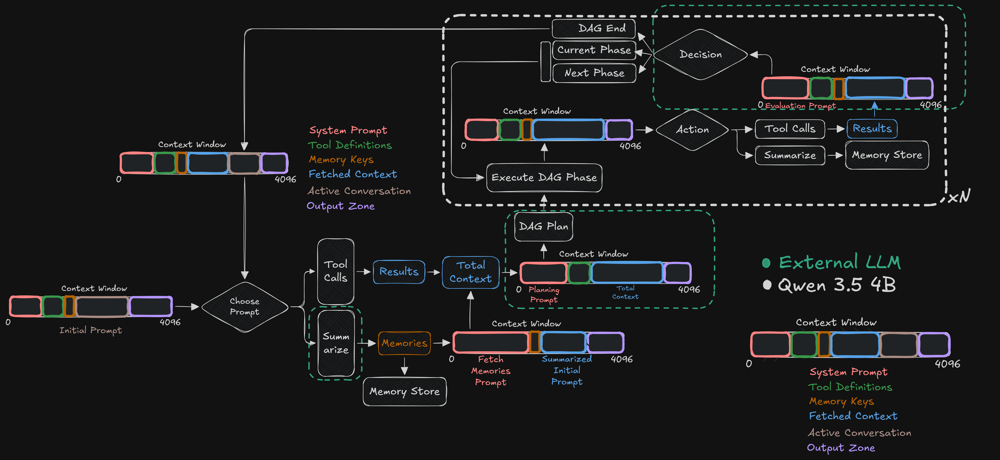

# Core
This file contains the core low-level harness to govern the model's context window. This is particularly needed when using 4B models with a large context window on constrained hardware.

>**Constrained Hardware**: Nvida RTX 3050 4GB Laptop GPU + 16GB DDR4 RAM (3200 MT/s) (10GB WSL2 + 6GB Windows 11 ) + AMD Ryzen 7 - 5000 Series

## Build Note
Please ensure you have separately built all the vendor codebases first before attempting to build the core harness.

## High Level Flow
