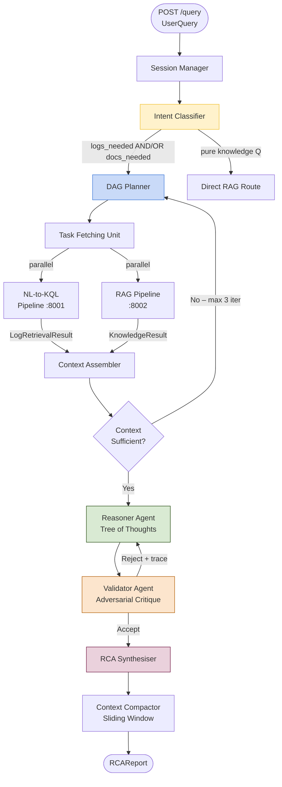
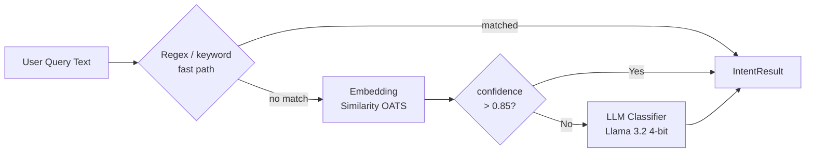
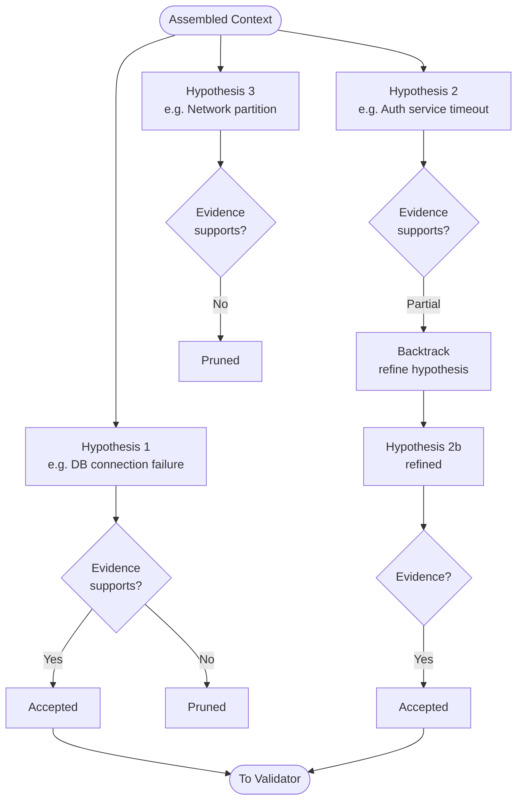

# master.md — Master LLM Orchestrator

> **Depends on:** `AGENTS.md` (read that first).  
> **Service port:** `8000`  
> **Primary model:** Llama 3.2 (via llama.cpp)  
> **Framework:** LangGraph state machine + FastAPI

---

## 1. Responsibility

The Master LLM Orchestrator is the cognitive kernel of NexGen. It:

- Receives a raw natural-language query from the user.
- Classifies intent and decomposes the query into a **Directed Acyclic Graph (DAG)** of sub-tasks.
- Routes sub-tasks concurrently to the NL-to-KQL Pipeline and/or the RAG Pipeline.
- Manages multi-turn session state.
- Applies Tree-of-Thoughts (ToT) reasoning to explore competing root-cause hypotheses.
- Validates hypotheses via a Reasoner–Validator dual-agent loop.
- Synthesises a final, confidence-scored `RCAReport`.

The Master LLM **never** writes KQL. It **never** queries Elasticsearch directly. It **never** reads from the vector store. Those responsibilities belong exclusively to the downstream components.

---

## 2. Internal Architecture



---

## 3. Module Breakdown

### 3.1 Session Manager (`session.py`)

Maintains per-session state across multiple user turns.

```
SessionState
├── session_id: str
├── query_history: list[UserQuery]
├── active_context_window: list[Message]      # sliding window, max 20 messages
├── topology_graph: dict | None               # loaded lazily from config
└── iteration_count: int                      # max 3 DAG iterations per query
```

**Key behaviours:**
- Persists state in Redis (key: `nexgen:session:{session_id}`) with a 2-hour TTL.
- On each new query within the same session, prepends the compressed summary of previous turns rather than the full history (mitigates the Lost-in-the-Middle effect).
- Exposes `session.trim_context()` which applies LongContextReorder — moves middle chunks to the edges before the final synthesis prompt is built.

---

### 3.2 Intent Classifier (`intent.py`)

A lightweight, fast-path classifier that avoids a full LLM call for recognisable patterns.



**`IntentResult` fields:**

| Field | Type | Description |
|-------|------|-------------|
| `logs_needed` | `bool` | Query requires structured log retrieval |
| `docs_needed` | `bool` | Query requires organisational knowledge |
| `is_quantitative` | `bool` | Requires exact counts/aggregations (→ always logs) |
| `is_qualitative` | `bool` | Asks for "why" / best practices (→ RAG-heavy) |
| `time_range` | `dict\|None` | Extracted temporal expression |
| `index_hints` | `list[str]` | Detected service names / index patterns |

**Routing table:**

| Scenario | logs_needed | docs_needed |
|----------|-------------|-------------|
| "Count HTTP 500s last hour" | ✅ | ❌ |
| "What is the best practice for X?" | ❌ | ✅ |
| "Why did payments fail at 09:57?" | ✅ | ✅ |
| "Summarise the last incident" | ❌ | ✅ |

---

### 3.3 DAG Planner (`planner.py`)

Translates `IntentResult` into a dependency graph of parallel tasks using the **LLM Compiler** pattern.

```python
# Conceptual DAG structure
tasks = [
    Task(id="T1", type="log_retrieval",   depends_on=[],     payload=LogRetrievalRequest(...)),
    Task(id="T2", type="knowledge",        depends_on=[],     payload=KnowledgeRequest(...)),
    Task(id="T3", type="rca_synthesis",   depends_on=["T1","T2"], payload=None),
]
```

- `T1` and `T2` are dispatched **concurrently** via `asyncio.gather`.
- `T3` waits for both; if only one is needed, the other is a no-op.
- The Planner re-runs (up to 3 times) if the Context Assembler reports `context_sufficient = False`.

**DAG serialisation format** stored in session state:
```json
{
  "dag_id": "uuid4",
  "tasks": [
    {"id": "T1", "type": "log_retrieval", "status": "complete", "depends_on": []},
    {"id": "T2", "type": "knowledge",     "status": "complete", "depends_on": []},
    {"id": "T3", "type": "rca_synthesis", "status": "pending",  "depends_on": ["T1","T2"]}
  ]
}
```

---

### 3.4 Task Fetching Unit (`executor.py`)

Dispatches DAG tasks concurrently. For each ready task (all dependencies resolved):

1. Serialise the request payload to the target service schema.
2. Call the downstream REST endpoint with a 30-second timeout.
3. On timeout/failure, emit error code `E003` or `E005` and mark the task `failed`.
4. Retry once with exponential back-off (1 s → 2 s).
5. Return the aggregated results to the Context Assembler.

---

### 3.5 Context Assembler (`context.py`)

Merges `LogRetrievalResult` and `KnowledgeResult` into `RCASynthesisInput`.

**Sufficiency heuristic:**

```python
def is_context_sufficient(log_result, knowledge_result, intent) -> bool:
    if intent.logs_needed and log_result.hit_count == 0:
        return False
    if intent.docs_needed and len(knowledge_result.chunks) == 0:
        return False
    if log_result.status == "failure" and knowledge_result.status == "failure":
        return False
    return True
```

**Sliding-window pruning:**  
The assembled context is trimmed to fit within `MAX_SYNTHESIS_TOKENS = 6000`. Pruning order (oldest first within tier):
1. Tier-B knowledge chunks (Slack, Jira comments)
2. Redundant log hits (duplicate `message` fields)
3. Tier-A knowledge chunks beyond the top-3

**LongContextReorder** is applied immediately before the synthesis prompt:  
Chunks are reordered so the highest-relevance items occupy positions 1 and N (first and last), and lower-relevance items fill the middle.

---

### 3.6 Reasoner Agent (`reasoner.py`) — Tree of Thoughts

Implements a three-branch ToT exploration:



**Thought prompting strategy:**  
Each thought is generated with:
```
System: You are a diagnostic reasoner. Given the evidence below, propose ONE specific 
root cause hypothesis. State: (a) the hypothesis, (b) the log lines that support it, 
(c) the log lines that contradict it. Be concise.
```

**Pruning:** A hypothesis is pruned if the model's own contradiction count exceeds 2 pieces of evidence.

**Max depth:** 3 levels. **Max branches:** 3 at root, 2 at level 2. **Algorithm:** Best-First Search by evidence-support score.

---

### 3.7 Validator Agent (`validator.py`)

An adversarial critic that receives accepted Reasoner hypotheses and checks them against:

1. **Topology graph** (`config/topology.json`) — verifies that the claimed service dependency actually exists. If Service A is blamed for disrupting Service B but no edge A→B exists, the claim is deterministically rejected with `E008`.
2. **Log timestamp consistency** — the claimed failure time must precede the symptom timestamps in the log evidence. Violations are flagged as logical inconsistencies.
3. **Knowledge grounding** — at least one `KnowledgeResult.chunk` must corroborate the hypothesis. A hypothesis with zero knowledge support is returned to the Reasoner with a critique note.

**Validator prompt:**
```
System: You are an adversarial critic. Review the hypothesis below. 
For each claim, state whether it is (SUPPORTED / UNSUPPORTED / CONTRADICTED) 
by the evidence. Then give a final verdict: ACCEPT or REJECT with a one-line reason.
```

**Loop exit condition:** Accept after ≤ 3 Reasoner→Validator cycles. If all 3 cycles end in REJECT, synthesise a "low-confidence" report flagging unresolved ambiguity.

---

### 3.8 RCA Synthesiser (`synthesiser.py`)

Produces the final `RCAReport` using the accepted hypothesis and full evidence.

**Prompt structure:**
```
System: You are a senior SRE generating a root cause analysis report. 
Use only the evidence provided. Do not invent facts. 
Output valid JSON matching the RCAReport schema.

Evidence:
<log_evidence>
<knowledge_chunks>
<accepted_hypothesis>
<validator_trace>
```

**Confidence score** is calculated as:
```
confidence = (log_support_count / total_log_hits) * 0.6
           + (knowledge_chunk_count / max_chunks) * 0.3
           + (1 if topology_verified else 0) * 0.1
```

---

## 4. Configuration (`master/.env.example`)

```env
# Service
MASTER_PORT=8000
LOG_LEVEL=INFO

# Downstream services
QUERY_SERVICE_URL=http://localhost:8001
RAG_SERVICE_URL=http://localhost:8002

# LLM (served by llama.cpp)
LLAMACPP_SERVER_URL=http://localhost:8080
MASTER_LLM_MODEL=llama3.2:8b-instruct-q4_K_M
MASTER_LLM_TEMPERATURE=0.2
MASTER_LLM_MAX_TOKENS=2048

# Session
REDIS_URL=redis://localhost:6379
SESSION_TTL_SECONDS=7200

# Orchestration
MAX_DAG_ITERATIONS=3
MAX_TOT_BRANCHES=3
MAX_VALIDATOR_CYCLES=3
MAX_SYNTHESIS_TOKENS=6000

# Topology
TOPOLOGY_CONFIG_PATH=config/topology.json
```

---

## 5. Key Files

```
master/
├── pyproject.toml
├── .env.example
└── src/
    ├── main.py              # FastAPI app, lifespan, /query /health /session
    ├── session.py           # SessionManager, Redis persistence
    ├── intent.py            # IntentClassifier (regex → OATS → LLM)
    ├── planner.py           # DAGPlanner, Task dataclass
    ├── executor.py          # TaskFetchingUnit, async dispatch
    ├── context.py           # ContextAssembler, sufficiency check, pruning
    ├── reasoner.py          # ReasonerAgent, ToT implementation
    ├── validator.py         # ValidatorAgent, topology check
    ├── synthesiser.py       # RCASynthesiser, confidence scoring
    └── prompts/
        ├── intent.txt
        ├── reasoner.txt
        ├── validator.txt
        └── synthesiser.txt
```

---

## 6. Testing Requirements

| Test | Location | Assertion |
|------|----------|-----------|
| Intent classification accuracy | `tests/unit/test_intent.py` | ≥ 95 % on 40-query fixture set |
| DAG planning with both routes | `tests/unit/test_planner.py` | T1 and T2 created, T3 depends on both |
| DAG planning logs-only | `tests/unit/test_planner.py` | T2 absent or no-op |
| Context sufficiency — empty logs | `tests/unit/test_context.py` | returns `False` |
| ToT pruning on contradiction | `tests/unit/test_reasoner.py` | branch dropped after 2 contradictions |
| Topology rejection | `tests/unit/test_validator.py` | `E008` raised for non-existent edge |
| Full orchestration (mocked downstream) | `tests/integration/test_master.py` | `RCAReport.confidence > 0` |

---

## 7. Performance Targets

| Metric | Target |
|--------|--------|
| P95 end-to-end latency (single-hop) | < 8 s |
| P95 end-to-end latency (dual-hop) | < 15 s |
| Session state write (Redis) | < 50 ms |
| Intent classification (fast path) | < 20 ms |
| Intent classification (LLM path) | < 2 s |
