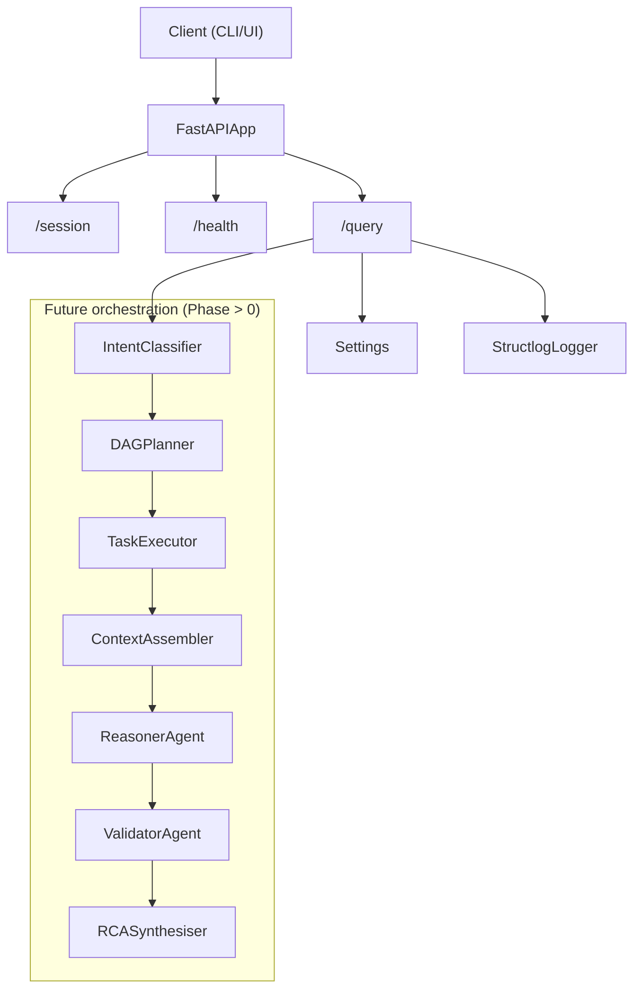

## Architecture



## How to test the endpoints

Test the endpoints:

1) Health Check
```bash
curl -X GET http://localhost:8000/health
```
Example response:
```json
{
  "status":"ok",
  "service":"master"
}
```

2) Fetch Session:
```bash
curl -X GET http://localhost:8000/session/{session_id}
```

for eg. 
```bash
curl -X GET http://localhost:8000/session/69
```

Example Response:
```json
{
  "session_id":"69",
  "history":[]
}
```

3) Query:
```bash
curl -X POST -H "Content-type: application/json" -d '{"query_id":"2","raw_text":"Some ra
aw text","session_id":"qwe123","timestamp_utc":"2026-04-07T17:15:00Z"}' http://localhost:8000
/query
```

Example response:
```json
{
  "query_id":"2",
  "root_cause_summary":"Not yet implement (Phase 0).",
  "confidence":0.0,
  "evidence":[
    {
      "type":"system",
      "ref":"master",
      "snippet":"Phase 0. Downstream calls not wired yet."
    }
  ],
  "recommended_actions":[
    "Implement Master Orchestration pipeline."
  ],
  "reasoning_trace_summary":"No reasoning here (Phase 0).",
  "mttr_estimate_minutes":0,
  "generated_at":"2026-04-07T18:12:58.846580Z"
}
```

## Mock Services Tasks (Interim)

Since the upstream `query` and `rag` pipelines are not yet fully implemented by other teams, the `master` module will utilize internal mock services to continue orchestrator development. We will mirror the target architecture as defined in `query.md` and `rag.md`.

### Mock Query Pipeline (`master/src/mock_query/`)
- [x] **M-Q1**: Scaffolding: Create package structure and empty modules (`schema_linker.py`, `few_shot.py`, etc.).
- [ ] **M-Q2**: Create `schema_linker.py` to return static `SchemaContext`.
- [ ] **M-Q3**: Create `few_shot.py` returning hardcoded KQL few-shots.
- [ ] **M-Q4**: Create `generator.py` for mocking KQL generation.
- [ ] **M-Q5**: Create `validator.py` and `repair.py` for syntax check mocks.
- [ ] **M-Q6**: Create `executor.py` to return local fixture ES hits and `pii.py` to mask them.
- [ ] **M-Q7**: Create `formatter.py` and integrate the end-to-end `pipeline.py`.

### Mock RAG Pipeline (`master/src/mock_rag/`)
- [x] **M-R1**: Scaffolding: Create package structure and empty modules.
- [ ] **M-R2**: Create `temporal.py`, `dense.py`, and `sparse.py` to mock document retrieval.
- [ ] **M-R3**: Create `fusion.py`, `reranker.py`, and `authority.py` to mock WRRF scoring and ranking.
- [ ] **M-R4**: Create `conflict.py` and `debate.py` to simulate NLI and debate resolution.
- [ ] **M-R5**: Create `compactor.py` and `id_preservation.py` to mock token pruning.
- [ ] **M-R6**: Integrate the end-to-end `pipeline.py`.