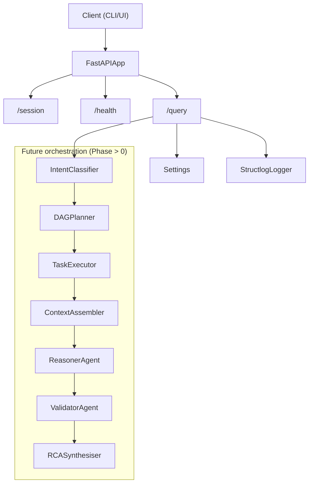

## Architecture



## How to test the endpoints

Test the endpoints:

1) Health Check
```bash
curl -X GET http://localhost:8000/health
```
Example response:
```json
{
  "status":"ok",
  "service":"master"
}
```

2) Fetch Session:
```bash
curl -X GET http://localhost:8000/session/{session_id}
```

for eg. 
```bash
curl -X GET http://localhost:8000/session/69
```

Example Response:
```json
{
  "session_id":"69",
  "history":[]
}
```

3) Query:
```bash
curl -X POST -H "Content-type: application/json" -d '{"query_id":"2","raw_text":"Some ra
aw text","session_id":"qwe123","timestamp_utc":"2026-04-07T17:15:00Z"}' http://localhost:8000
/query
```

Example response:
```json
{
  "query_id":"2",
  "root_cause_summary":"Not yet implement (Phase 0).",
  "confidence":0.0,
  "evidence":[
    {
      "type":"system",
      "ref":"master",
      "snippet":"Phase 0. Downstream calls not wired yet."
    }
  ],
  "recommended_actions":[
    "Implement Master Orchestration pipeline."
  ],
  "reasoning_trace_summary":"No reasoning here (Phase 0).",
  "mttr_estimate_minutes":0,
  "generated_at":"2026-04-07T18:12:58.846580Z"
}
```