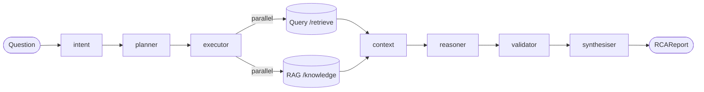

# NexGen Master Orchestrator

Takes a plain-English question about an incident, fetches logs (Query service) and docs (RAG service) in parallel,
finds and verifies the root cause, and returns an `RCAReport`. See [STUDY_GUIDE.md](../STUDY_GUIDE.md) for the
design and [eval/RESULTS.md](eval/RESULTS.md) for benchmark numbers.


```mermaid
flowchart LR
    Q([Question]) --> I[intent] --> P[planner] --> E[executor]
    E -->|parallel| L[(Query /retrieve)]
    E -->|parallel| D[(RAG /knowledge)]
    L --> C[context] 
    D --> C
    C --> R[reasoner] --> V[validator] --> S[synthesiser] --> O([RCAReport])
```

## Run

```bash
cd master
uv sync
cp .env.example .env            # MOCK_SERVICES=true works with nothing else running
uv run uvicorn src.main:app --port 8000
uv run streamlit run app.py     # optional visual demo
uv run pytest                   # tests
uv run python eval/run_eval.py --mode rules   # benchmark without LLM
uv run python eval/run_eval.py --mode llm     # benchmark with the LLM in .env
```

## Endpoints

```bash
curl localhost:8000/health
curl -X POST localhost:8000/query -H 'Content-Type: application/json' -d '{
  "query_id": "1", "session_id": "demo", "timestamp_utc": "2026-10-03T10:00:00Z",
  "raw_text": "Why are users getting 504 timeouts when logging in through the gateway?"}'
curl localhost:8000/session/demo      # 404 if the session does not exist
```
