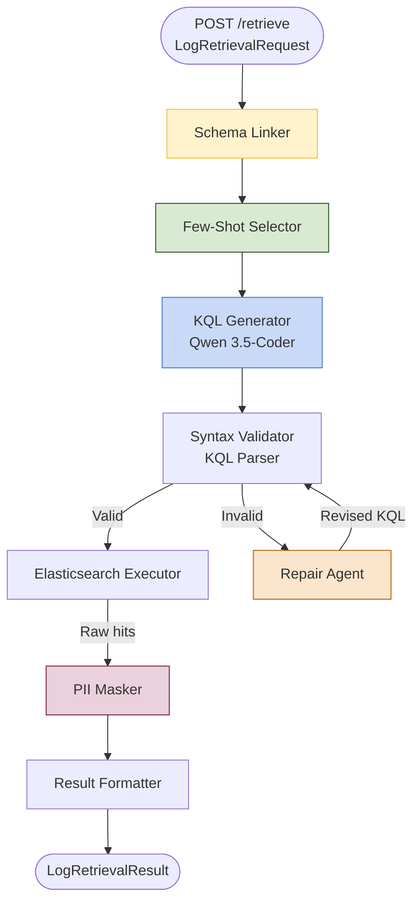
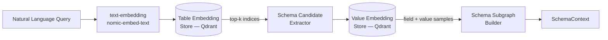
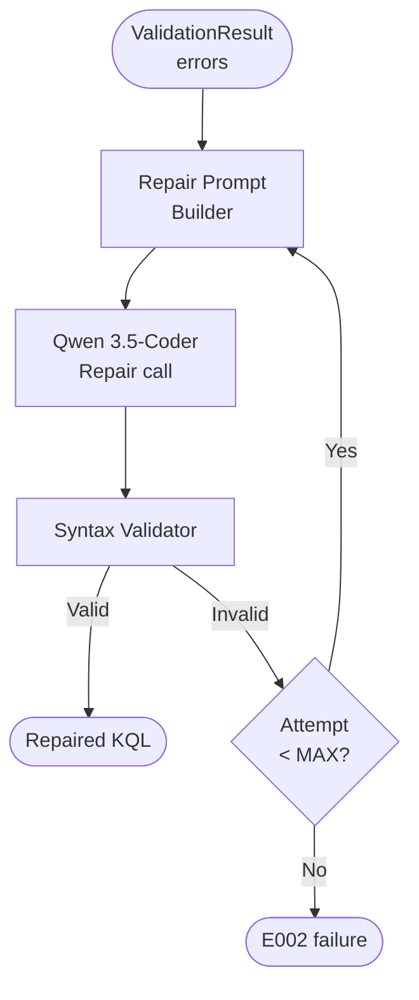

# query.md — NL-to-KQL Pipeline

> **Depends on:** `AGENTS.md` (read that first).  
> **Service port:** `8001`  
> **Primary model:** Qwen 3.5-Coder (via llama.cpp, 4-bit quantised GGUF)  
> **Framework:** FastAPI + custom pipeline stages

---

## 1. Responsibility

The NL-to-KQL Pipeline accepts a `LogRetrievalRequest` from the Master LLM Orchestrator, translates the embedded natural language into a syntactically valid Kibana Query Language (KQL) script, executes it against the Elasticsearch backend, applies PII masking on the results, and returns a `LogRetrievalResult`.

This component **never** performs root-cause reasoning. It **never** calls the RAG Pipeline. It **never** stores results persistently. Its sole outputs are structured log hits and metadata about the query that produced them.

---

## 2. Internal Architecture



---

## 3. Module Breakdown

### 3.1 Schema Linker (`schema_linker.py`)

**Purpose:** Map the natural-language query to the most relevant Elasticsearch index patterns and field names before any generation occurs.

**Two-stage process:**



**`SchemaContext` payload:**
```python
@dataclass
class SchemaContext:
    selected_indices: list[str]        # e.g. ["payments-*", "gateway-logs-*"]
    relevant_fields: list[FieldMeta]   # name, type, sample_values
    time_field: str                    # e.g. "@timestamp"
    max_result_size: int
```

**`FieldMeta`:**
```python
@dataclass
class FieldMeta:
    name: str             # e.g. "http.status_code"
    es_type: str          # "keyword" | "integer" | "date" | "nested" | ...
    sample_values: list   # up to 5 representative values
    is_nested: bool
    nested_path: str | None
```

**Schema cache:** Index mappings are fetched from Elasticsearch at startup and refreshed every 5 minutes into an in-memory dict (key: index pattern). Freshness is exposed via `GET /schema-cache/status`.

**Nested field handling:**  
When `is_nested = True`, the Schema Linker annotates the field with its `nested_path` and injects a note into the Few-Shot Selector's context: `"NESTED FIELD — must use nested query wrapper"`. This prevents the generator from producing flat dot-notation queries against nested arrays (which would trigger cross-object matching in Elasticsearch).

---

### 3.2 Few-Shot Selector (`few_shot.py`)

**Purpose:** Retrieve the *k* most semantically similar historical NLQ→KQL pairs to provide the generator with in-context syntactical blueprints.

**Vector database:** A dedicated Qdrant collection `nexgen_few_shot` stores curated NLQ→KQL pairs. Each document is embedded using `nomic-embed-text`.

**Selection algorithm:**
1. Embed the incoming `natural_language` field.
2. Query Qdrant with `limit=8`, `score_threshold=0.72`.
3. Filter out examples that reference index patterns not present in `SchemaContext.selected_indices`.
4. Return the top `k=4` examples (configurable via `FEW_SHOT_K`).

**Example pair format injected into the prompt:**
```
### Example 1
NLQ: Show me all ERROR logs from the auth service in the past 1 hour
KQL: service.name: "auth" AND log.level: "ERROR" AND @timestamp >= now-1h
```

**Cold-start:** If fewer than 2 examples are found above threshold, the selector falls back to a static set of 4 general KQL templates included in `data/fallback_examples.jsonl`.

---

### 3.3 KQL Generator (`generator.py`)

**Model:** `qwen2.5-coder:7b-instruct-q4_K_M` via Ollama.  
**Temperature:** `0.05` (near-deterministic — critical for syntax correctness).  
**Max tokens:** `512`.

**System prompt (stored in `prompts/generator.txt`):**
```
You are a Kibana Query Language (KQL) expert for Elasticsearch / Kibana.
Given a natural language question, a database schema, and examples, 
output ONLY a syntactically valid KQL query — no explanations, no markdown fences.

Rules:
- Use only the fields listed in the schema below.
- Respect nested field annotations; always wrap nested fields in a nested query.
- For time ranges, use the @timestamp field unless schema specifies otherwise.
- Do not hallucinate field names not present in the schema.

Schema:
{schema_context}

Examples:
{few_shot_examples}

Question: {natural_language}
KQL:
```

**DPO-aligned behaviour:** The model has been fine-tuned (or guided by system prompt) to prefer the structurally minimal, most direct query over verbose alternatives, following the Direct Preference Optimisation principle of exploiting the single lowest-entropy valid solution.

---

### 3.4 Syntax Validator (`validator.py`)

**Purpose:** Deterministically verify the generated KQL before execution.

**Implementation:** A hand-written recursive-descent parser covering the KQL grammar:
- Field existence check against `SchemaContext.relevant_fields`
- Balanced parentheses / brackets
- Operator validity (AND, OR, NOT, :, >=, <=, >)
- Nested query structure when `is_nested = True`
- Time expression syntax (`now-Xm`, `now-Xh`, ISO-8601 literals)

**Output:** `ValidationResult(valid: bool, errors: list[str], ast: dict | None)`

The AST is a lightweight JSON tree used by the Repair Agent and for AST-based evaluation metrics.

---

### 3.5 Repair Agent (`repair.py`)

Triggered when `ValidationResult.valid = False`.



**Repair prompt template:**
```
The following KQL query failed validation:

QUERY:
{failed_kql}

ERRORS:
{error_list}

SCHEMA:
{schema_context}

Rewrite the query to fix these errors. Output ONLY valid KQL, no explanations.
KQL:
```

**Max attempts:** `MAX_REPAIR_ATTEMPTS = 3` (configurable). Each attempt is logged as a separate OpenTelemetry span. The `refinement_attempts` counter in `LogRetrievalResult` reflects the total.

---

### 3.6 Elasticsearch Executor (`executor.py`)

**Purpose:** Execute the validated KQL against the live Elasticsearch cluster.

**Implementation notes:**
- Uses the official `elasticsearch-py` async client.
- Translates KQL to the Elasticsearch Query DSL internally (via a lightweight KQL→DSL transpiler in `kql_dsl.py`). This is necessary because Elasticsearch's REST API accepts DSL JSON, not raw KQL string in the `_search` body for programmatic calls.
- Enforces `max_results` from the request (default 500, hard cap 2000).
- Sets `timeout=20s` on the Elasticsearch call.
- On `ConnectionError` or `TransportError`, raises `E003`.

**Result shape:** Returns a list of raw `_source` dicts plus `total.value` for the hit count.

---

### 3.7 PII Masker (`pii.py`)

Applied to every raw log hit **before** it leaves this service.

**Masking rules (regex-based, applied in order):**

| Pattern | Replacement |
|---------|-------------|
| IPv4 addresses | `<IP_ADDR>` |
| IPv6 addresses | `<IP_ADDR_V6>` |
| Email addresses | `<EMAIL>` |
| JWT tokens (`eyJ...`) | `<JWT_TOKEN>` |
| SHA-256/MD5 hashes | `<HASH>` |
| Credit card numbers (Luhn-valid) | `<CC_NUMBER>` |
| Phone numbers (E.164) | `<PHONE>` |
| AWS access key IDs | `<AWS_KEY>` |

**Preservation:** Technical identifiers critical for diagnosis (trace IDs, span IDs, error codes) use a different regex pattern and are **not** masked — they are tagged with `<TRACE_ID:value>` instead, preserving referential integrity across the session.

---

### 3.8 Result Formatter (`formatter.py`)

Assembles the final `LogRetrievalResult` from all upstream outputs:

```python
LogRetrievalResult(
    query_id=request.query_id,
    status="success" | "partial" | "failure",
    kql_generated=validated_kql,
    syntax_valid=True,
    refinement_attempts=n,
    hits=[...masked_hits],
    hit_count=total_hits,
    error=None
)
```

`status = "partial"` when `hit_count > 0` but the Elasticsearch reported `_shards.failed > 0`.

---

## 4. Evaluation Metrics (Internal)

This component should be benchmarked on a held-out evaluation set (stored in `data/eval_set.jsonl`) using:

| Metric | Definition | Target |
|--------|-----------|--------|
| **Execution Success Rate (ESR)** | % of generated KQL queries that execute without error | ≥ 90 % |
| **Exact Match (EM)** | % of generated ASTs logically equivalent to the ground-truth AST | ≥ 75 % |
| **Refinement Rate** | % of queries requiring ≥ 1 repair cycle | ≤ 20 % |
| **Mean refinement attempts** | Average repair iterations across all queries | ≤ 1.3 |
| **PII leak rate** | % of hits containing unmasked PII patterns | 0 % |
| **Schema hallucination rate** | % of generated field names absent from schema | ≤ 2 % |

Evaluation is run via:
```bash
cd query && python -m pytest tests/eval/ -v --eval-set data/eval_set.jsonl
```

---

## 5. Configuration (`query/.env.example`)

```env
# Service
QUERY_PORT=8001
LOG_LEVEL=INFO

# Elasticsearch
ELASTICSEARCH_URL=http://localhost:9200
ELASTICSEARCH_USERNAME=elastic
ELASTICSEARCH_PASSWORD=changeme
ES_REQUEST_TIMEOUT=20
ES_MAX_RESULTS_HARD_CAP=2000

# LLM (served by llama.cpp)
LLAMACPP_SERVER_URL=http://localhost:8081
QUERY_LLM_MODEL=qwen2.5-coder:7b-instruct-q4_K_M
QUERY_LLM_TEMPERATURE=0.05
QUERY_LLM_MAX_TOKENS=512

# Vector store (few-shot + schema)
QDRANT_URL=http://localhost:6333
FEW_SHOT_COLLECTION=nexgen_few_shot
SCHEMA_TABLE_COLLECTION=nexgen_schema_tables
SCHEMA_VALUE_COLLECTION=nexgen_schema_values
FEW_SHOT_K=4
FEW_SHOT_SCORE_THRESHOLD=0.72

# Pipeline
MAX_REPAIR_ATTEMPTS=3
SCHEMA_CACHE_REFRESH_INTERVAL_SECONDS=300
DEFAULT_MAX_RESULTS=500
```

---

## 6. Key Files

```
query/
├── pyproject.toml
├── .env.example
├── data/
│   ├── eval_set.jsonl
│   └── fallback_examples.jsonl
├── prompts/
│   ├── generator.txt
│   └── repair.txt
└── src/
    ├── main.py              # FastAPI app, /retrieve /health /schema-cache/status
    ├── schema_linker.py     # SchemaLinker, FieldMeta, SchemaContext
    ├── few_shot.py          # FewShotSelector, Qdrant lookup
    ├── generator.py         # KQLGenerator, Ollama call
    ├── validator.py         # KQLValidator, recursive-descent parser
    ├── repair.py            # RepairAgent, retry loop
    ├── executor.py          # ElasticsearchExecutor, KQL→DSL transpiler
    ├── kql_dsl.py           # KQL-to-DSL transpilation layer
    ├── pii.py               # PIIMasker, regex catalogue
    └── formatter.py         # ResultFormatter
```

---

## 7. Testing Requirements

| Test | Location | Assertion |
|------|----------|-----------|
| Schema linking retrieves correct index | `tests/unit/test_schema_linker.py` | `payments-*` found for "payments service" |
| Nested field annotation | `tests/unit/test_schema_linker.py` | `is_nested=True` field has `nested_path` |
| Few-shot returns ≤ k examples | `tests/unit/test_few_shot.py` | len(result) ≤ 4 |
| Few-shot cold start | `tests/unit/test_few_shot.py` | falls back to static set |
| Generator produces non-empty KQL | `tests/unit/test_generator.py` | output non-empty, no markdown fences |
| Validator catches unclosed paren | `tests/unit/test_validator.py` | `valid=False`, error mentions paren |
| Validator accepts valid KQL | `tests/unit/test_validator.py` | `valid=True`, AST not None |
| Repair fixes simple syntax error | `tests/unit/test_repair.py` | `valid=True` after 1 attempt |
| Repair fails after MAX_REPAIR_ATTEMPTS | `tests/unit/test_repair.py` | `E002` raised |
| PII masker removes IPv4 | `tests/unit/test_pii.py` | `<IP_ADDR>` in output |
| PII masker preserves trace ID | `tests/unit/test_pii.py` | `<TRACE_ID:abc123>` preserved |
| End-to-end with mock ES | `tests/integration/test_pipeline.py` | `LogRetrievalResult.status == "success"` |
| ESR on eval set | `tests/eval/test_esr.py` | ≥ 90 % |

---

## 8. Performance Targets

| Metric | Target |
|--------|--------|
| Schema linking latency | < 200 ms |
| Few-shot retrieval latency | < 150 ms |
| KQL generation latency (Qwen local) | < 3 s |
| Syntax validation latency | < 10 ms |
| Elasticsearch query latency (P95) | < 5 s |
| Total `/retrieve` P95 latency (no repair) | < 6 s |
| Total `/retrieve` P95 latency (1 repair) | < 10 s |
