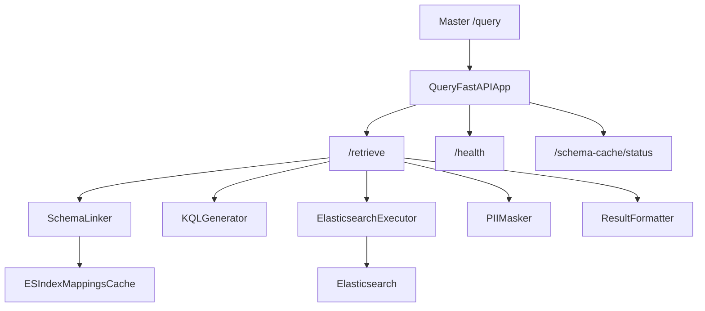

## Architecture

This diagram shows how the NL-to-KQL service receives a `LogRetrievalRequest`, links it to index schemas, generates KQL, executes against Elasticsearch, masks PII, and returns a `LogRetrievalResult`.

