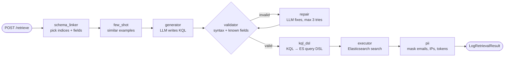

# NexGen Query Service (NL → KQL, port 8001)

Turns a natural-language log request into a Kibana KQL query, runs it on Elasticsearch, masks personal
data, and returns a `LogRetrievalResult`. See [../STUDY_GUIDE.md](../STUDY_GUIDE.md) for the design.


```mermaid
flowchart LR
    R([POST /retrieve]) --> S[schema_linker<br/>pick indices + fields]
    S --> F[few_shot<br/>similar examples]
    F --> G[generator<br/>LLM writes KQL]
    G --> V{validator<br/>syntax + known fields}
    V -- invalid --> P[repair<br/>LLM fixes, max 3 tries] --> V
    V -- valid --> D[kql_dsl<br/>KQL → ES query DSL]
    D --> E[executor<br/>Elasticsearch search]
    E --> M[pii<br/>mask emails, IPs, tokens] --> O([LogRetrievalResult])
```

```bash
cd query
uv sync --extra dev
GROQ_API_KEY=... GROQ_MODEL=openai/gpt-oss-20b uv run uvicorn src.main:app --port 8001
uv run pytest            # unit tests; Elasticsearch/LLM tests skip if those are not running
```

Endpoints: `POST /retrieve`, `GET /health`, `GET /schema-cache/status`, `GET /metrics` (Prometheus).
