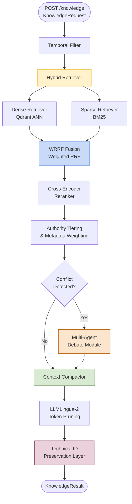
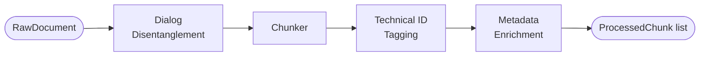
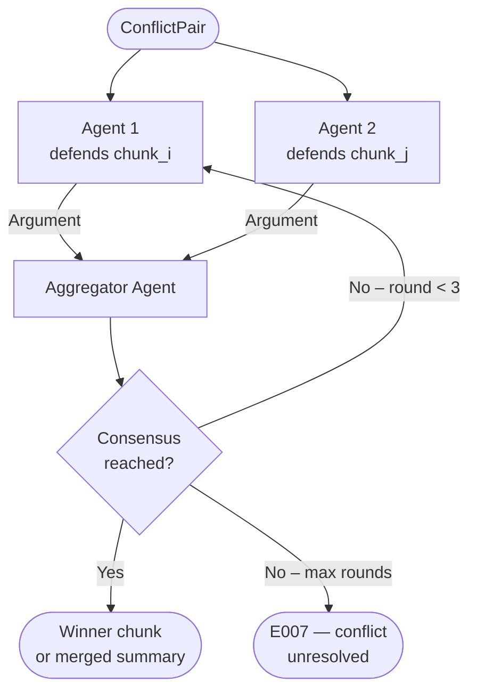

# rag.md — RAG / Contextual Pipeline

> **Depends on:** `AGENTS.md` (read that first).  
> **Service port:** `8002`  
> **Embedding model:** `nomic-embed-text` via llama.cpp  
> **Framework:** FastAPI + Qdrant + custom retrieval stages

---

## 1. Responsibility

The RAG / Contextual Pipeline is the organisational knowledge layer of NexGen. It ingests, indexes, and retrieves knowledge from diverse enterprise sources — runbooks, architectural docs, Slack threads, Jira tickets, GitHub PRs — and delivers a compressed, conflict-resolved, authority-weighted context payload to the Master LLM Orchestrator.

This component **never** generates KQL. It **never** queries Elasticsearch for live logs. It **never** performs root-cause synthesis. It is solely responsible for retrieving the *right* knowledge, in the *right* form, at the *right* time.

---

## 2. Internal Architecture



---

## 3. Data Ingestion & Indexing

### 3.1 Source Connectors (`connectors/`)

Each connector is a standalone class implementing the `BaseConnector` interface:

```python
class BaseConnector(ABC):
    @abstractmethod
    async def fetch(self, since: datetime | None) -> list[RawDocument]: ...
    
    @abstractmethod
    def source_type(self) -> SourceType: ...  # "runbook" | "jira" | "slack" | "github"
```

| Connector | Source | Auth |
|-----------|--------|------|
| `ConfluenceConnector` | Confluence Cloud REST API | API token |
| `JiraConnector` | Jira Cloud REST API | API token |
| `SlackConnector` | Slack Export / Conversations API | Bot token |
| `GitHubConnector` | GitHub REST API (PRs, commits) | PAT |
| `LocalFileConnector` | `/data/docs/` directory | — |

**`RawDocument` schema:**
```python
@dataclass
class RawDocument:
    doc_id: str
    source_type: str         # "runbook" | "jira" | "slack" | "github"
    source_uri: str
    title: str
    raw_text: str
    created_at: datetime
    updated_at: datetime
    author: str
    metadata: dict           # source-specific extras (e.g. jira_status, pr_merged)
```

### 3.2 Pre-Processing Pipeline (`preprocessor.py`)

Applied to every `RawDocument` before embedding:



**Dialog Disentanglement** (Slack only):  
A lightweight feedforward classifier (`models/disentangle_model.pt`) partitions interleaved Slack threads into discrete conversations. Each conversation is then classified as `problem_description` or `resolution`. Only resolution chunks are forwarded for embedding.

**Chunker:**

| Source Type | Strategy |
|-------------|----------|
| `runbook`, `github` | Recursive character splitting; chunk size 512 tokens, overlap 64 |
| `jira` | One chunk per issue comment; bounded at 256 tokens |
| `slack` | Thread-boundary chunking + 5-minute burst windowing |
| `code` | AST-aware splitting (function/class boundaries) |

**Technical ID Tagging:**  
Before chunking, a regex pass identifies and wraps technical identifiers:
- IP addresses → `<IP_ADDR:192.168.1.1>`
- Trace / span IDs → `<TRACE_ID:abc123>`
- SHA hashes → `<HASH:d8c05cb>`
- File paths → `<PATH:/var/log/app.log>`
- Error codes → `<ERROR_CODE:ERR_CONN_RESET>`

These tagged forms are embedded and stored as-is, ensuring they survive compression.

**Metadata Enrichment:**  
Each chunk is annotated with:
```python
@dataclass
class ChunkMetadata:
    chunk_id: str
    doc_id: str
    source_type: str
    source_uri: str
    authority_tier: str        # "A" | "B"
    created_at: datetime
    resolution_status: str     # "open" | "resolved" | "deprecated" | "unknown"
    is_accepted_answer: bool
    recency_score: float       # computed at index time; refreshed daily
```

**Authority tier assignment:**

| Source | Tier |
|--------|------|
| Merged GitHub PR | A |
| Official runbook / Confluence page | A |
| Resolved Jira ticket (is_accepted_answer=True) | A |
| Jira comment | B |
| Slack message | B |
| Open/unresolved Jira issue | B |

### 3.3 Embedding & Indexing

**Model:** `nomic-embed-text` (768-dim) via Ollama.

**Qdrant collections:**

| Collection | Contents | Index type |
|------------|----------|------------|
| `nexgen_dense` | Chunk embeddings | HNSW (cosine) |
| `nexgen_bm25_terms` | BM25 term statistics | Sparse vector (SPLADE or BM42) |

**Ingestion endpoint:** `POST /ingest`  
Body: `{ "source_type": "slack", "full_reindex": false }`  
Behaviour: Fetches documents from the connector since `last_indexed_at`, processes and upserts into Qdrant. Idempotent.

---

## 4. Retrieval Modules

### 4.1 Temporal Filter (`temporal.py`)

Applied **before** vector search to hard-bound the retrieval window.

```python
def apply_temporal_filter(
    request: KnowledgeRequest,
    qdrant_filter: models.Filter
) -> models.Filter:
    """
    Enforces as-of correctness: no document with created_at > request.time_window.not_after
    is ever returned, preventing future knowledge from contaminating historical forensics.
    Additionally applies an exponential recency decay to the similarity scores post-retrieval.
    """
```

**Recency decay formula** applied to raw similarity scores:
```
score_weighted = raw_score * exp(-λ * Δdays)
```
where `λ = 0.02` (soft decay; documents 50 days old retain ~37 % of score weight).

### 4.2 Dense Retriever (`dense.py`)

- Embeds `KnowledgeRequest.semantic_query` with `nomic-embed-text`.
- Queries Qdrant `nexgen_dense` with `limit = max_chunks * 3` to give the fusion stage enough candidates.
- Applies the Temporal Filter as a Qdrant payload filter.

### 4.3 Sparse Retriever (`sparse.py`)

- Tokenises `semantic_query` and computes BM25 term weights.
- Queries Qdrant `nexgen_bm25_terms` sparse vector index.
- Guarantees that exact technical identifiers (error codes, trace IDs) are surfaced even when semantically distant.

### 4.4 WRRF Fusion (`fusion.py`)

**Weighted Reciprocal Rank Fusion:**

```
WRRF(d) = w_dense * (1 / (k + rank_dense(d)))
        + w_sparse * (1 / (k + rank_sparse(d)))
```

Where `k = 60` (smoothing constant).

**Dynamic weight assignment** based on query characteristics:

| Query characteristic | `w_dense` | `w_sparse` |
|---------------------|-----------|------------|
| Mostly natural language | 0.7 | 0.3 |
| Contains error codes / trace IDs | 0.3 | 0.7 |
| Mixed | 0.5 | 0.5 |

The classifier is a 10-feature rule-based scorer (alphanumeric token ratio, special character density, etc.) — no LLM call required.

### 4.5 Cross-Encoder Reranker (`reranker.py`)

After WRRF fusion, the top-`max_chunks * 2` candidates are passed to a cross-encoder model (`cross-encoder/ms-marco-MiniLM-L-6-v2`) that jointly scores `(query, chunk)` pairs for contextual relevance. This is the final ranking step before authority weighting.

### 4.6 Authority Tiering & Metadata Weighting (`authority.py`)

Applies multiplicative boosts to the cross-encoder scores:

```python
def compute_final_score(chunk: RankedChunk) -> float:
    base = chunk.cross_encoder_score
    tier_boost = 1.25 if chunk.metadata.authority_tier == "A" else 1.0
    resolution_boost = 1.15 if chunk.metadata.is_accepted_answer else 1.0
    deprecated_penalty = 0.3 if chunk.metadata.resolution_status == "deprecated" else 1.0
    recency = chunk.metadata.recency_score  # pre-computed at index time [0,1]
    return base * tier_boost * resolution_boost * deprecated_penalty * recency
```

Top-`max_chunks` chunks after this scoring are forwarded to conflict detection.

---

## 5. Conflict Detection & Resolution

### 5.1 Conflict Detector (`conflict.py`)

Detects semantic contradictions between retrieved chunks using Natural Language Inference (NLI):

```python
def detect_conflicts(chunks: list[RankedChunk]) -> list[ConflictPair]:
    """
    For every pair (i, j) in the top-k chunks:
    - Run NLI model (cross-encoder/nli-deberta-v3-small) on (chunk_i.content, chunk_j.content)
    - If label == CONTRADICTION and confidence > 0.8: add to conflict_pairs
    """
```

If `len(conflict_pairs) == 0`, skip the debate module.

### 5.2 Multi-Agent Debate Module (`debate.py`)

Activated only when conflicts are detected.



**Agent prompts are strictly evidence-constrained:**
```
System: You are defending the following document. 
Using ONLY the text of your assigned document, explain why it is the most accurate 
and current answer. Do not introduce external knowledge.

Document: {chunk_content}
Opposing document: {opposing_chunk_content}
```

**Aggregator prompt:**
```
System: Two agents have argued for conflicting documents. 
Given both arguments, determine which document is more reliable based on:
1. Recency (prefer newer)
2. Authority tier (prefer A over B)
3. Internal logical consistency
Output: WINNER: [1|2|MERGE] followed by a one-paragraph justification.
```

When `WINNER = MERGE`, the aggregator synthesises a single reconciled chunk (max 200 tokens) that acknowledges the ambiguity and presents the safer guidance.

---

## 6. Context Compaction

### 6.1 LLMLingua-2 Token Pruner (`compactor.py`)

After conflict resolution, the surviving chunks are compressed to fit within `KnowledgeRequest.compression_budget_tokens`.

**Algorithm:**
1. Concatenate all chunks into a single prompt payload.
2. Run LLMLingua-2 (`mbert-base-multilingual-cased` fine-tuned for compression) as a binary token classifier.
3. Tokens classified `discard` are removed; `preserve` tokens are kept.
4. Technical ID tags (`<TRACE_ID:...>`, `<IP_ADDR:...>`, etc.) are **always** classified as `preserve` — this is enforced by a pre-pass that sets their compression probability to 1.0.
5. Target compression ratio: `actual_tokens / budget_tokens` adjusted iteratively until within ±5 % of budget.

**Fallback:** If LLMLingua-2 is unavailable, fall back to extractive sentence-level selection using cosine similarity to the query embedding.

### 6.2 Technical ID Preservation Layer (`id_preservation.py`)

A post-compression verification pass:
1. Extract all `<TAG:value>` patterns from the original uncompressed chunks.
2. Verify each appears in the compressed output.
3. For any missing tag, re-inject the tag at the nearest semantically similar sentence boundary.
4. Log any re-injection as a warning metric: `nexgen_rag_id_reinjected_total`.

---

## 7. RAGAS Evaluation Integration

The pipeline exposes a self-evaluation mode (disabled in production) that computes RAGAS metrics on demand:

| RAGAS Metric | Internal implementation |
|---|---|
| **Context Precision** | Evaluating LLM judges whether top-ranked chunks are relevant |
| **Context Recall** | Ground-truth answer decomposed; each fact checked against retrieved chunks |
| **Faithfulness** | Generated atomic claims cross-referenced with chunk content |
| **Noise Sensitivity** | Deliberate injection of off-topic chunks; measure answer degradation |

Run evaluation:
```bash
cd rag && python -m pytest tests/eval/ --ragas --eval-set data/ragas_eval.jsonl
```

---

## 8. Configuration (`rag/.env.example`)

```env
# Service
RAG_PORT=8002
LOG_LEVEL=INFO

# Embedding (served by llama.cpp)
LLAMACPP_EMBED_SERVER_URL=http://localhost:8082
EMBEDDING_MODEL=nomic-embed-text

# Vector store
QDRANT_URL=http://localhost:6333
DENSE_COLLECTION=nexgen_dense
SPARSE_COLLECTION=nexgen_bm25_terms
FEW_SHOT_COLLECTION=nexgen_few_shot

# Retrieval
DEFAULT_MAX_CHUNKS=12
WRRF_K=60
CROSS_ENCODER_MODEL=cross-encoder/ms-marco-MiniLM-L-6-v2
NLI_MODEL=cross-encoder/nli-deberta-v3-small
CONFLICT_CONFIDENCE_THRESHOLD=0.8

# Compaction
LLMLINGUA2_MODEL=microsoft/llmlingua-2-bert-base-multilingual-cased-meetingbank
DEFAULT_COMPRESSION_BUDGET_TOKENS=2000

# Connectors (enable/disable per deployment)
CONFLUENCE_BASE_URL=https://your-org.atlassian.net/wiki
CONFLUENCE_API_TOKEN=changeme
JIRA_BASE_URL=https://your-org.atlassian.net
JIRA_API_TOKEN=changeme
SLACK_BOT_TOKEN=xoxb-changeme
GITHUB_PAT=ghp_changeme

# Debate
MAX_DEBATE_ROUNDS=3

# Recency
RECENCY_DECAY_LAMBDA=0.02
```

---

## 9. Key Files

```
rag/
├── pyproject.toml
├── .env.example
├── data/
│   ├── ragas_eval.jsonl
│   └── docs/                     # local fallback documents
├── models/
│   └── disentangle_model.pt      # Slack thread classifier
├── prompts/
│   ├── debate_agent.txt
│   └── debate_aggregator.txt
└── src/
    ├── main.py                   # FastAPI app, /knowledge /health /ingest
    ├── connectors/
    │   ├── base.py               # BaseConnector ABC
    │   ├── confluence.py
    │   ├── jira.py
    │   ├── slack.py
    │   ├── github.py
    │   └── local_file.py
    ├── preprocessor.py           # Disentanglement, chunker, tagging, metadata
    ├── temporal.py               # Temporal filter, recency decay
    ├── dense.py                  # Dense retriever
    ├── sparse.py                 # Sparse / BM25 retriever
    ├── fusion.py                 # WRRF fusion, weight classifier
    ├── reranker.py               # Cross-encoder reranker
    ├── authority.py              # Tier boosts, metadata scoring
    ├── conflict.py               # NLI-based conflict detector
    ├── debate.py                 # Multi-agent debate, aggregator
    ├── compactor.py              # LLMLingua-2 token pruner
    └── id_preservation.py       # Technical ID re-injection
```

---

## 10. Testing Requirements

| Test | Location | Assertion |
|------|----------|-----------|
| Temporal filter excludes future docs | `tests/unit/test_temporal.py` | doc after `not_after` not in results |
| Dense retrieval returns embeddings | `tests/unit/test_dense.py` | returns ≥ 1 chunk for known query |
| WRRF weights adjust for error codes | `tests/unit/test_fusion.py` | `w_sparse = 0.7` for trace-ID query |
| Authority tier A ranked above B | `tests/unit/test_authority.py` | runbook score > Slack score |
| Deprecated doc penalised | `tests/unit/test_authority.py` | deprecated chunk not in top-5 |
| Conflict detection finds contradiction | `tests/unit/test_conflict.py` | ≥ 1 ConflictPair for known contradictory docs |
| Debate resolves to winner | `tests/unit/test_debate.py` | `WINNER` in aggregator output |
| LLMLingua preserves technical tags | `tests/unit/test_compactor.py` | all `<TRACE_ID:*>` tags present post-compression |
| Token budget not exceeded | `tests/unit/test_compactor.py` | output tokens ≤ budget + 5 % |
| Slack disentanglement | `tests/unit/test_preprocessor.py` | resolution chunk isolated from noise |
| End-to-end /knowledge call | `tests/integration/test_rag.py` | `KnowledgeResult.status == "success"` |
| RAGAS context precision | `tests/eval/test_ragas.py` | ≥ 0.75 |
| RAGAS faithfulness | `tests/eval/test_ragas.py` | ≥ 0.80 |
| RAGAS noise sensitivity | `tests/eval/test_ragas.py` | ≤ 0.20 (lower is better) |

---

## 11. Performance Targets

| Metric | Target |
|--------|--------|
| Dense retrieval latency | < 200 ms |
| Sparse retrieval latency | < 150 ms |
| Cross-encoder reranking (12 chunks) | < 500 ms |
| Conflict detection (12 chunks pairwise) | < 1 s |
| Debate module (when triggered) | < 8 s |
| LLMLingua-2 compression | < 1 s |
| Total `/knowledge` P95 latency (no conflict) | < 3 s |
| Total `/knowledge` P95 latency (with debate) | < 12 s |
| Ingestion throughput | ≥ 100 chunks/s |
