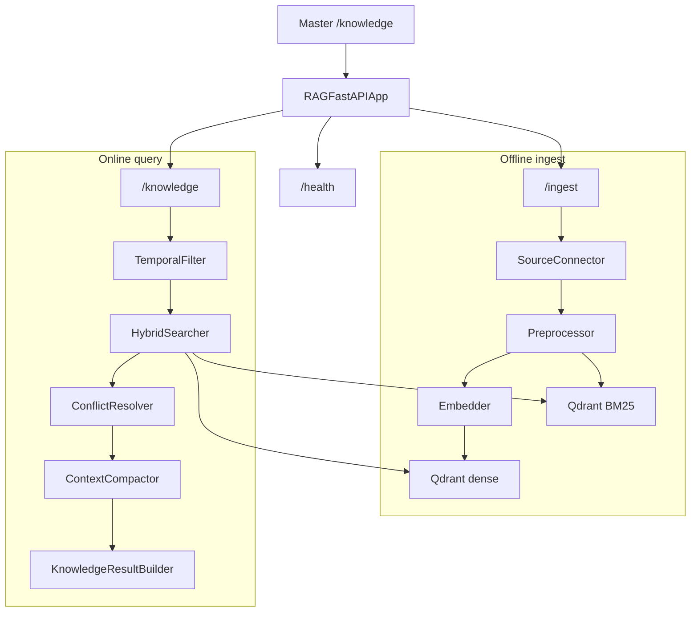

## Architecture

```mermaid
flowchart TD
    client["Master /knowledge"] --> api[RAGFastAPIApp]
    api --> knowledgeRoute["/knowledge"]
    api --> ingestRoute["/ingest"]
    api --> healthRoute["/health"]

    subgraph offlineIngest["Offline ingest"]
        ingestRoute --> connector[SourceConnector]
        connector --> preprocessor[Preprocessor]
        preprocessor --> embedder[Embedder]
        embedder --> qdrantDense["Qdrant dense"]
        preprocessor --> qdrantSparse["Qdrant BM25"]
    end

    subgraph onlineQuery["Online query"]
        knowledgeRoute --> temporalFilter[TemporalFilter]
        temporalFilter --> hybridSearch[HybridSearcher]
        hybridSearch --> conflictResolver[ConflictResolver]
        conflictResolver --> compactor[ContextCompactor]
        compactor --> responseBuilder[KnowledgeResultBuilder]
    end

    hybridSearch --> qdrantDense
    hybridSearch --> qdrantSparse
```

This diagram shows how the RAG service ingests documents into Qdrant collections and later serves `KnowledgeResult` responses for incoming `KnowledgeRequest` queries.

