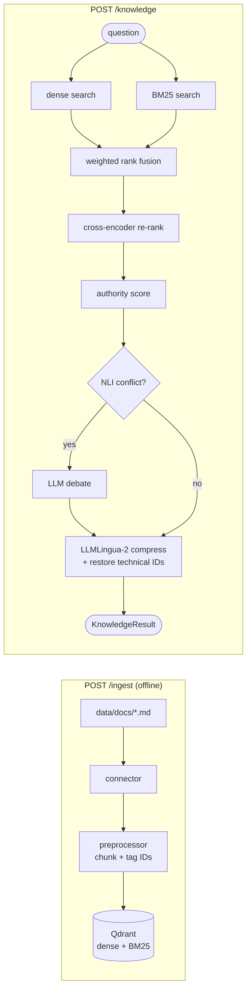

# NexGen RAG Service (port 8002)

Finds the runbooks, incident reports and chat threads relevant to a question and returns them as a
`KnowledgeResult`. See [../STUDY_GUIDE.md](../STUDY_GUIDE.md) for the design and
[tests/eval/RESULTS.md](tests/eval/RESULTS.md) for evaluation numbers.



```bash
cd rag
uv sync
LLAMACPP_EMBED_SERVER_URL=http://localhost:11434 uv run uvicorn src.main:app --port 8002   # needs Qdrant + Ollama
uv run pytest            # unit + integration tests (mocked); the live eval is opt-in
scripts/eval.sh          # RAGAS-style evaluation -> tests/eval/RESULTS.md
```
